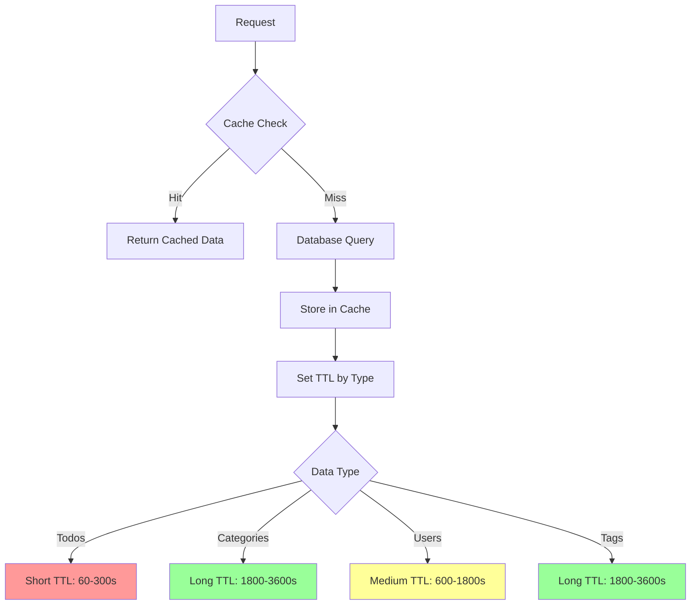
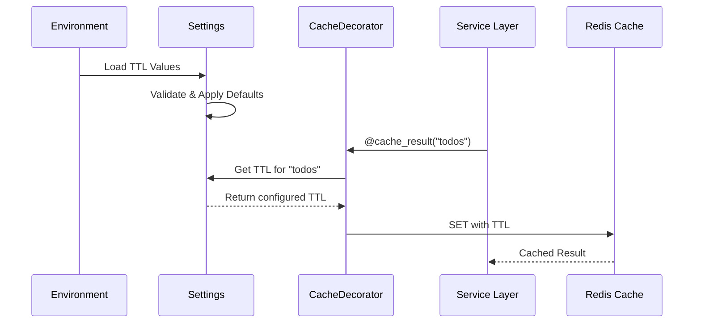
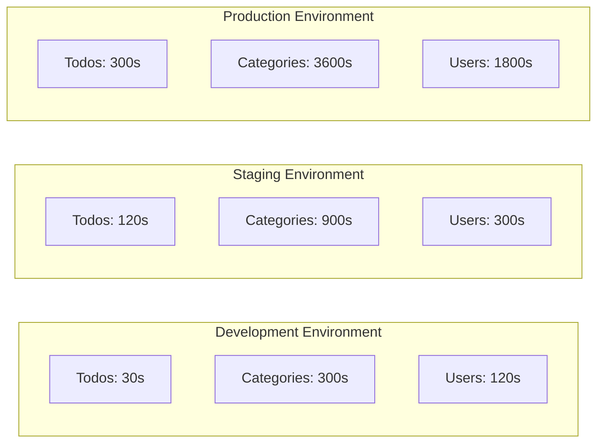
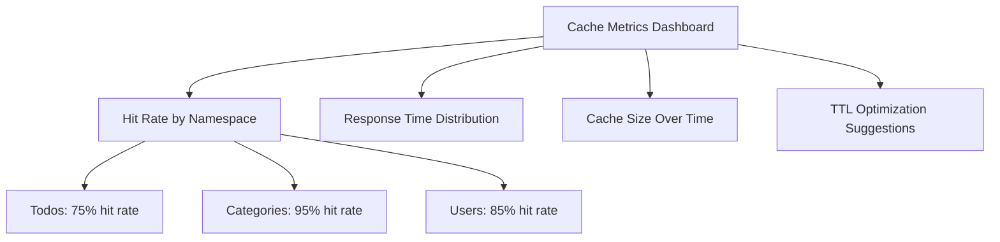

# Product Requirements Document: Configurable Cache TTL

## 1. Executive Summary

Dieses PRD beschreibt die Implementierung konfigurierbarer Cache Time-To-Live (TTL) Werte für die Todo API. Aktuell sind alle Cache TTLs auf 300 Sekunden (5 Minuten) hartcodiert, was zu suboptimaler Performance und unnötigen Datenbankzugriffen führt. Die Lösung ermöglicht flexible, umgebungsspezifische und datentypbasierte TTL-Konfiguration für optimale Balance zwischen Performance und Datenaktualität.

## 2. Problem & Solution

### Problem Statement

Das aktuelle Cache-System hat folgende Probleme:

1. **Hartcodierte TTL-Werte**
   - Alle Caches verwenden fix 300 Sekunden
   - Keine Anpassung an Datencharakteristika
   - Keine umgebungsspezifische Konfiguration

2. **One-Size-Fits-All Approach**
   - Häufig ändernde Daten (Todos) = 5 Min
   - Selten ändernde Daten (Kategorien) = 5 Min
   - Statische Daten (User-Profile) = 5 Min

3. **Performance-Verschwendung**
   - Kategorien werden unnötig oft neu geladen
   - Keine Optimierung basierend auf Zugriffsmustern
   - Erhöhte Datenbanklast ohne Nutzen

### Solution Overview

Implementierung eines flexiblen Cache-TTL-Systems mit:
- Umgebungsvariablen für TTL-Konfiguration
- Datentypspezifische TTL-Strategien
- Sinnvolle Standardwerte basierend auf Änderungshäufigkeit
- Einfache Anpassbarkeit ohne Code-Änderungen

## 3. User Stories

### Epic: Flexibles Cache-Management

#### Story 1: DevOps TTL-Konfiguration
**Als** DevOps Engineer  
**möchte ich** Cache TTLs per Umgebungsvariablen konfigurieren  
**damit** ich Performance ohne Code-Deployment optimieren kann

**Acceptance Criteria:**
- [ ] TTL-Werte über .env konfigurierbar
- [ ] Sinnvolle Standardwerte vorhanden
- [ ] Dokumentation der verfügbaren Optionen
- [ ] Validierung der konfigurierten Werte

#### Story 2: Entwickler Cache-Strategie
**Als** Backend-Entwickler  
**möchte ich** datentypbasierte Cache-Strategien  
**damit** jeder Datentyp optimal gecacht wird

**Acceptance Criteria:**
- [ ] Unterschiedliche TTLs für verschiedene Datentypen
- [ ] Klare Namenskonvention für Cache-Konfiguration
- [ ] Einfache Erweiterbarkeit für neue Datentypen
- [ ] Cache-Strategie dokumentiert

#### Story 3: Performance-Optimierung
**Als** System Administrator  
**möchte ich** Cache-Metriken und -Einstellungen  
**damit** ich die optimale Balance finde

**Acceptance Criteria:**
- [ ] Cache-Hit-Rate messbar
- [ ] TTL-Anpassung ohne Neustart möglich
- [ ] Monitoring der Cache-Performance
- [ ] A/B-Testing verschiedener TTL-Werte

## 4. Technical Architecture

### Cache TTL Strategy



### Configuration Flow



### TTL Configuration Matrix



## 5. Implementation Details

### 5.1 Configuration Schema

#### Update app/config.py
```python
class Settings(BaseSettings):
    # ... existing settings ...
    
    # Cache TTL Configuration (in seconds)
    cache_ttl_default: int = Field(
        default=300,
        description="Default cache TTL in seconds",
        ge=0,  # Must be >= 0 (0 = no cache)
        le=86400  # Max 24 hours
    )
    
    cache_ttl_todos: int = Field(
        default=300,  # 5 minutes
        description="TTL for todo items cache",
        ge=0,
        le=3600  # Max 1 hour for frequently changing data
    )
    
    cache_ttl_categories: int = Field(
        default=1800,  # 30 minutes
        description="TTL for categories cache",
        ge=0,
        le=86400
    )
    
    cache_ttl_users: int = Field(
        default=600,  # 10 minutes
        description="TTL for user data cache",
        ge=0,
        le=7200
    )
    
    cache_ttl_tags: int = Field(
        default=3600,  # 1 hour
        description="TTL for tags cache",
        ge=0,
        le=86400
    )
    
    # Cache feature flags
    cache_enabled: bool = Field(
        default=True,
        description="Enable/disable caching globally"
    )
    
    def get_cache_ttl(self, namespace: str) -> int:
        """Get TTL for a specific cache namespace."""
        ttl_map = {
            "todos": self.cache_ttl_todos,
            "categories": self.cache_ttl_categories,
            "users": self.cache_ttl_users,
            "tags": self.cache_ttl_tags,
        }
        return ttl_map.get(namespace, self.cache_ttl_default)
```

### 5.2 Cache Decorator Enhancement

#### Update app/utils/cache.py
```python
from app.config import settings

def cache_result(
    namespace: str,
    ttl: int | None = None,  # Now optional
    key_prefix: str = "",
    include_user: bool = True
):
    """Enhanced cache decorator with configurable TTL.
    
    Args:
        namespace: Cache namespace (e.g., 'todos', 'categories')
        ttl: Optional TTL override. If None, uses configured value.
        key_prefix: Optional prefix for cache key
        include_user: Include user_id in cache key if available
    """
    def decorator(func: Callable) -> Callable:
        @functools.wraps(func)
        async def wrapper(*args, **kwargs):
            # Skip caching if disabled
            if not settings.cache_enabled:
                return await func(*args, **kwargs)
            
            # Get TTL from config if not provided
            cache_ttl = ttl if ttl is not None else settings.get_cache_ttl(namespace)
            
            # Skip caching if TTL is 0
            if cache_ttl == 0:
                return await func(*args, **kwargs)
            
            # ... rest of caching logic with cache_ttl
```

### 5.3 Service Layer Updates

#### Update service decorators
```python
# app/services/todo.py
class TodoService:
    # Remove hardcoded TTL
    @cache_result("todos")  # Uses settings.cache_ttl_todos
    async def get_todo(self, todo_id: UUID, user_id: UUID) -> Todo | None:
        # ... existing code
    
    @cache_result("todos")  # Uses settings.cache_ttl_todos
    async def get_todos(self, ...) -> tuple[list[Todo], int]:
        # ... existing code

# app/services/category.py
class CategoryService:
    @cache_result("categories")  # Uses settings.cache_ttl_categories
    async def get_category(self, ...) -> Category | None:
        # ... existing code
```

### 5.4 Environment Configuration

#### Update .env.example
```bash
# Cache Configuration
CACHE_ENABLED=true

# Cache TTL Values (in seconds)
# Default TTL for unspecified namespaces
CACHE_TTL_DEFAULT=300

# Data-specific TTLs
# Todos change frequently (1-10 minutes recommended)
CACHE_TTL_TODOS=300

# Categories change rarely (30-60 minutes recommended)
CACHE_TTL_CATEGORIES=1800

# User data changes occasionally (10-30 minutes recommended)
CACHE_TTL_USERS=600

# Tags are mostly static (60+ minutes recommended)
CACHE_TTL_TAGS=3600

# Development values (shorter for testing)
# CACHE_TTL_TODOS=30
# CACHE_TTL_CATEGORIES=120
# CACHE_TTL_USERS=60
# CACHE_TTL_TAGS=300
```

### 5.5 Cache Strategy Documentation

#### Create docs/CACHE-STRATEGY.md
```markdown
# Cache Strategy Guide

## TTL Recommendations by Data Type

### High Frequency Changes (30s - 5min)
- Todo items during active work hours
- Real-time collaboration data
- Temporary session data

### Medium Frequency Changes (5min - 30min)
- User profiles
- Project settings
- Activity logs

### Low Frequency Changes (30min - 24h)
- Categories
- Tags
- System configurations
- Static content

## Environment-Specific Settings

### Development
- Short TTLs for immediate feedback
- Easy cache invalidation
- Verbose logging

### Staging
- Production-like TTLs
- Performance testing
- Cache warming strategies

### Production
- Optimized TTLs based on metrics
- High cache hit rates
- Monitoring and alerts
```

## 6. Testing Strategy

### 6.1 Unit Tests
```python
def test_configurable_cache_ttl():
    """Test that cache TTL is configurable."""
    settings.cache_ttl_todos = 60
    assert settings.get_cache_ttl("todos") == 60

def test_cache_disabled():
    """Test cache can be disabled."""
    settings.cache_enabled = False
    # Verify no caching occurs

def test_zero_ttl_disables_cache():
    """Test that TTL=0 disables caching."""
    settings.cache_ttl_todos = 0
    # Verify no caching for todos
```

### 6.2 Integration Tests
```python
async def test_different_ttls_per_namespace():
    """Test different namespaces have different TTLs."""
    # Set different TTLs
    settings.cache_ttl_todos = 60
    settings.cache_ttl_categories = 3600
    
    # Verify todos expire after 60s
    # Verify categories still cached after 60s
```

## 7. Migration Guide

### Phase 1: Add Configuration (No Breaking Changes)
1. Add new settings with current defaults (300s)
2. Update cache decorator to use settings
3. Test with existing behavior

### Phase 2: Optimize TTLs
1. Monitor cache hit rates
2. Adjust TTLs based on data:
   - Todos: 60-300s
   - Categories: 1800-3600s
   - Users: 600-1800s
   - Tags: 3600-7200s

### Phase 3: Environment-Specific Tuning
1. Development: Short TTLs for testing
2. Staging: Medium TTLs
3. Production: Optimized TTLs

## 8. Monitoring & Metrics

### Key Metrics to Track
```yaml
cache_metrics:
  - cache_hit_rate: "Percentage of requests served from cache"
  - cache_miss_rate: "Percentage requiring database queries"
  - avg_response_time: "Average response time by cache status"
  - cache_size: "Memory usage by namespace"
  - ttl_effectiveness: "Hit rate vs TTL length correlation"
```

### Monitoring Dashboard


## 9. Risks & Mitigations

### Risk Matrix

| Risk | Probability | Impact | Mitigation |
|------|------------|--------|------------|
| Stale data from long TTLs | Medium | Medium | Cache invalidation on updates |
| Increased DB load from short TTLs | Low | High | Monitoring & gradual adjustment |
| Configuration errors | Low | Low | Validation & safe defaults |
| Cache stampede | Low | High | Jitter in TTL values |

### Mitigation Strategies

1. **Stale Data Prevention**
   - Maintain cache invalidation on updates
   - Add cache versioning if needed
   - Monitor data freshness

2. **Performance Protection**
   - Start with conservative TTLs
   - Monitor database load
   - Implement cache warming

3. **Configuration Safety**
   - Validate TTL ranges
   - Provide sensible defaults
   - Document best practices

## 10. Success Metrics

### Immediate (Week 1)
- [ ] All cache decorators use configured TTLs
- [ ] No hardcoded TTL values remain
- [ ] Configuration documented

### Short-term (Month 1)
- [ ] 20% reduction in database queries
- [ ] Cache hit rate > 80% for categories
- [ ] Response time improvement > 15%

### Long-term (Quarter 1)
- [ ] Optimized TTLs for all data types
- [ ] Automated TTL tuning based on metrics
- [ ] 90%+ cache hit rate for static data

## Implementation Checklist

### Phase 1: Core Implementation (2 hours)
- [ ] Update Settings class with TTL configuration
- [ ] Enhance cache decorator to use settings
- [ ] Remove all hardcoded TTL values
- [ ] Update .env.example

### Phase 2: Service Updates (1 hour)
- [ ] Update TodoService decorators
- [ ] Update CategoryService decorators
- [ ] Update TagService decorators
- [ ] Update UserService decorators

### Phase 3: Testing (2 hours)
- [ ] Write unit tests for configuration
- [ ] Write integration tests for TTL behavior
- [ ] Test cache disable functionality
- [ ] Performance benchmarking

### Phase 4: Documentation (1 hour)
- [ ] Create cache strategy guide
- [ ] Update README with cache config
- [ ] Document TTL recommendations
- [ ] Add monitoring setup guide

### Phase 5: Deployment (1 hour)
- [ ] Update development environment
- [ ] Configure staging with medium TTLs
- [ ] Deploy to production with monitoring
- [ ] Verify metrics collection

## Appendix A: TTL Calculation Formula

```python
def calculate_optimal_ttl(
    change_frequency: float,  # Changes per hour
    read_frequency: float,    # Reads per hour
    db_query_cost: float,     # Milliseconds
    acceptable_staleness: float  # Minutes
) -> int:
    """Calculate optimal TTL based on access patterns."""
    # High read/write ratio = longer TTL
    # High change frequency = shorter TTL
    # High query cost = longer TTL
    
    base_ttl = 300  # 5 minutes baseline
    
    # Adjust based on patterns
    if change_frequency < 1:  # Less than once per hour
        base_ttl *= 4  # 20 minutes
    elif change_frequency > 60:  # More than once per minute
        base_ttl /= 2  # 2.5 minutes
    
    # Factor in query cost
    if db_query_cost > 100:  # Expensive queries
        base_ttl *= 1.5
    
    # Respect staleness requirements
    max_ttl = acceptable_staleness * 60
    
    return int(min(base_ttl, max_ttl))
```

## Appendix B: Redis Memory Estimation

```yaml
cache_memory_usage:
  todos:
    avg_size: 1KB
    max_items: 10000
    total: 10MB
  
  categories:
    avg_size: 0.5KB
    max_items: 1000
    total: 0.5MB
  
  users:
    avg_size: 2KB
    max_items: 5000
    total: 10MB
  
  tags:
    avg_size: 0.2KB
    max_items: 500
    total: 0.1MB
  
  total_estimated: 20.6MB
```