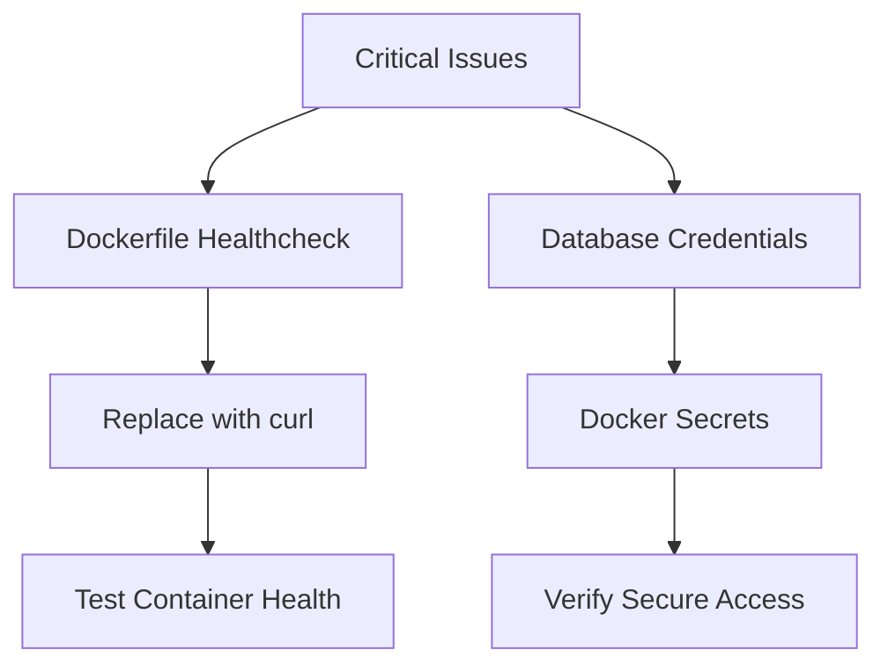
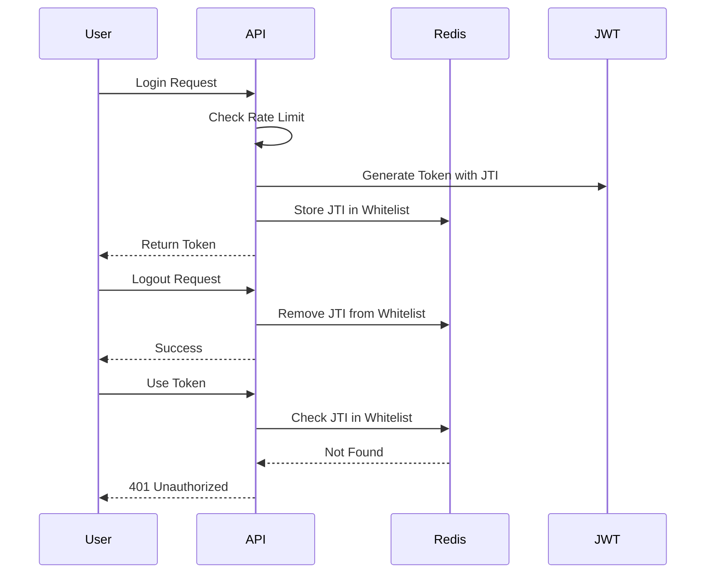
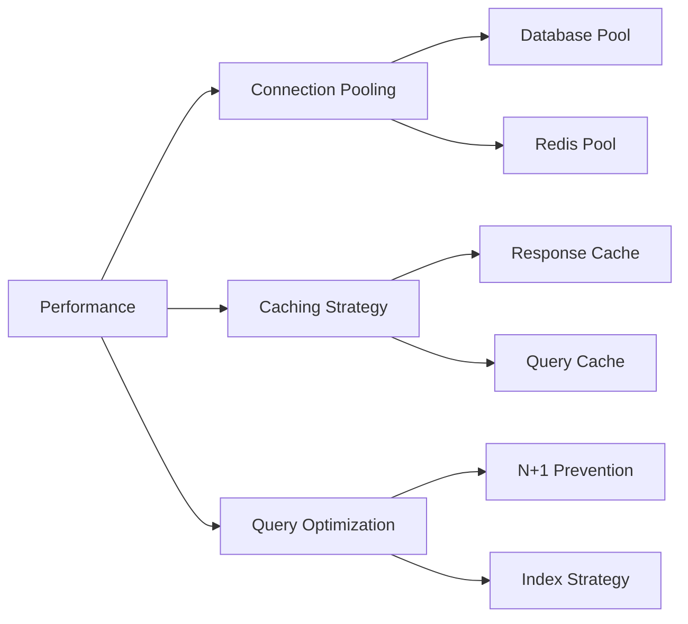
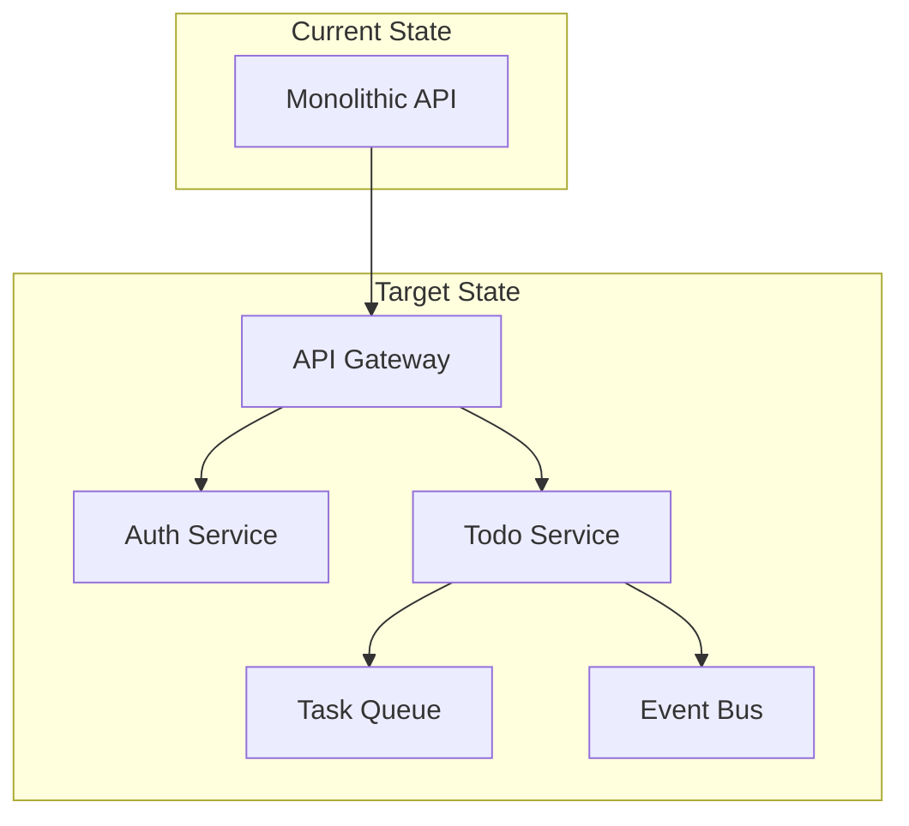
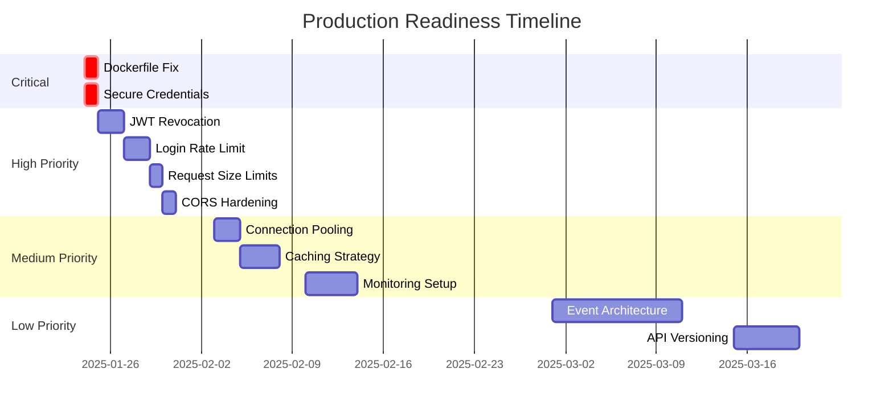

name: "Maßnahmenplan für Code Review #001 - Todo API Production Hardening"
description: |

## Purpose
Systematischer Maßnahmenplan zur Behebung aller Code Review Findings und Vorbereitung der Todo API für den Produktionseinsatz.

## Philosophy
1. **Sicherheit zuerst**: Kritische Sicherheitslücken haben höchste Priorität
2. **Schrittweise Verbesserung**: Von kritisch zu nice-to-have
3. **Validierung eingebaut**: Jede Maßnahme mit messbarem Erfolg
4. **Production Ready**: Ziel ist eine vollständig produktionsreife API

---

## Initial Concept
Basierend auf Code Review #001 vom 2025-01-24 mit 34 identifizierten Issues (2 Critical, 6 High, 13 Medium, 13 Low).

## Planning Process

### ✅ Phase 1: Sofortmaßnahmen (This Week)

#### 🔴 Kritische Sicherheitslücken (MUSS sofort behoben werden)



##### ✅ 1. Dockerfile Healthcheck Reparatur
```yaml
issue: Container health checks schlagen fehl
location: docker/Dockerfile:40
priority: CRITICAL
effort: 30 minutes

solution:
  - Replace Python healthcheck with curl
  - Alternative: Install requests package
  
implementation:
  file: docker/Dockerfile
  change: |
    # OLD:
    HEALTHCHECK CMD python -c "import requests; requests.get('http://localhost:8000/health')"
    
    # NEW:
    HEALTHCHECK CMD curl -f http://localhost:8000/health || exit 1

validation:
  - docker build -t todo-api .
  - docker run --health-cmd test todo-api
  - docker inspect <container_id> | grep Health
```

##### ✅ 2. Datenbank-Credentials Sicherung
```yaml
issue: Credentials im Klartext in docker-compose.yml
location: docker/docker-compose.yml
priority: CRITICAL  
effort: 2 hours

solution:
  - Implement Docker secrets
  - Use .env files with proper gitignore
  
implementation:
  - Create docker-compose.prod.yml with secrets
  - Update .env.example
  - Add secrets management documentation

validation:
  - Verify no credentials in git history
  - Test deployment with secrets
  - Security scan with trivy
```

#### ✅ 🟠 High Priority Security Issues


##### ✅ 3. JWT Token Revocation implementieren
```yaml
issue: Keine Möglichkeit, kompromittierte Tokens zu widerrufen
location: app/services/auth.py, app/utils/security.py
priority: HIGH
effort: 4 hours

solution:
  - Redis-based JWT blacklist with JTI claim
  - Token versioning per user
  - Automatic cleanup of expired tokens

implementation:
  new_files:
    - app/services/token_blacklist.py
    - tests/unit/test_token_blacklist.py
  
  modifications:
    - app/utils/security.py: Add JTI to token payload
    - app/middleware/auth.py: Check blacklist
    - app/api/auth.py: Add logout endpoint

validation:
  - Unit tests for blacklist service
  - Integration test for logout flow
  - Performance test for blacklist lookup
```

##### ✅ 4. Rate Limiting für Login-Versuche
```yaml
issue: Brute-Force-Angriffe auf Passwörter möglich
location: app/api/auth.py
priority: HIGH
effort: 3 hours

solution:
  - Per-user failed attempt counter
  - Exponential backoff (1, 2, 4, 8... minutes)
  - Account lockout after N attempts
  - Admin unlock capability

implementation:
  - Redis keys: failed_attempts:{user_email}
  - Lockout duration calculation
  - Clear on successful login
  - Monitoring alerts

validation:
  - Test exponential backoff
  - Verify account lockout
  - Performance under attack simulation
```

##### ✅ 5. Request Size Limits
```yaml
issue: DoS durch große Payloads möglich
location: app/main.py
priority: HIGH
effort: 1 hour

solution:
  - Global request size limit (10MB default)
  - Per-endpoint customization
  - Clear error messages

implementation:
  app/main.py: |
    from fastapi import Request, HTTPException
    
    @app.middleware("http")
    async def limit_request_size(request: Request, call_next):
        max_size = 10 * 1024 * 1024  # 10MB
        if request.headers.get("content-length"):
            if int(request.headers["content-length"]) > max_size:
                raise HTTPException(413, "Request too large")
        return await call_next(request)

validation:
  - Test with oversized payloads
  - Verify error responses
  - Check memory usage
```

### Phase 2: Kurzfristige Verbesserungen (This Month)

#### ✅ Performance & Operational Excellence



##### ✅ 6. Database Connection Pooling
```yaml
issue: Keine Verbindungspools konfiguriert
location: app/database.py
priority: MEDIUM
effort: 2 hours

solution:
  - SQLAlchemy connection pool configuration
  - Pool size based on worker count
  - Connection recycling

implementation:
  pool_config:
    pool_size: 20
    max_overflow: 40
    pool_timeout: 30
    pool_recycle: 3600
    pool_pre_ping: true

validation:
  - Load test with concurrent users
  - Monitor connection count
  - Verify connection reuse
```

##### 7. Caching Strategy
```yaml
issue: Keine Caching-Strategie für häufige Abfragen
location: app/services/
priority: MEDIUM
effort: 6 hours

solution:
  - Redis-based response caching
  - Cache invalidation strategy
  - TTL configuration per endpoint

implementation:
  - Cache decorator for services
  - Category tree caching
  - User permission caching
  - Automatic invalidation on updates

validation:
  - Measure response time improvement
  - Verify cache invalidation
  - Test cache stampede prevention
```

##### ✅ 8. Monitoring & Observability
```yaml
issue: Keine Überwachung oder Metriken
location: app/
priority: MEDIUM
effort: 8 hours

solution:
  - OpenTelemetry integration
  - Prometheus metrics
  - Structured logging
  - Distributed tracing

implementation:
  components:
    - Request duration metrics
    - Database query metrics
    - Cache hit rates
    - Error rates by endpoint
    - Custom business metrics

validation:
  - Verify metrics export
  - Test alert triggers
  - Dashboard functionality
```

### Phase 3: Langfristige Verbesserungen (This Quarter)

#### Architektur & Skalierung



##### 9. Event-Driven Architecture
```yaml
issue: Keine asynchrone Verarbeitung für lange Operationen
priority: LOW
effort: 2 weeks

solution:
  - Celery for task queue
  - Redis as message broker
  - Event sourcing for audit trail

implementation:
  - Background task infrastructure
  - Webhook system
  - Event replay capability
  - Dead letter queue

validation:
  - Task execution tests
  - Failure recovery tests
  - Performance benchmarks
```

##### 10. API Versioning Strategy
```yaml
issue: Nur URL-Prefix-Versionierung
priority: LOW
effort: 1 week

solution:
  - Header-based versioning
  - Content negotiation
  - Deprecation strategy
  - Version compatibility matrix

implementation:
  - Version middleware
  - Schema versioning
  - Migration guides
  - Backward compatibility tests

validation:
  - Multi-version testing
  - Client compatibility
  - Performance impact
```

## Implementation Timeline



## Validation & Testing Strategy

### Sicherheitstests
```bash
# OWASP ZAP Security Scan
docker run -t owasp/zap2docker-stable zap-baseline.py -t http://localhost:8000

# Dependency Security Check
pip-audit
safety check

# Container Security
trivy image todo-api:latest
```

### Performance Tests
```bash
# Load Testing mit Locust
locust -f tests/performance/locustfile.py --host=http://localhost:8000

# Stress Testing
artillery run tests/performance/stress-test.yml

# Database Performance
pgbench -c 10 -j 2 -t 1000 todo_db
```

### Integration Tests
```bash
# Full Test Suite
pytest tests/ -v --cov=app --cov-report=html

# API Contract Tests
pytest tests/contract/ -v

# End-to-End Tests
pytest tests/e2e/ -v --headed
```

## Success Metrics

### Immediate (Week 1)
- [ ] Zero critical security issues
- [ ] All container health checks passing
- [ ] No plaintext credentials in codebase

### Short Term (Month 1)
- [ ] JWT revocation working
- [ ] Rate limiting preventing brute force
- [ ] 90%+ test coverage
- [ ] <100ms average response time

### Long Term (Quarter 1)
- [ ] 99.9% uptime
- [ ] <50ms p95 latency
- [ ] Zero security vulnerabilities
- [ ] Full observability stack

## Risk Mitigation

```yaml
risks:
  deployment:
    risk: "Breaking changes during fixes"
    mitigation: "Feature flags for gradual rollout"
  
  performance:
    risk: "Increased latency from security features"
    mitigation: "Caching and connection pooling"
  
  complexity:
    risk: "Over-engineering simple fixes"
    mitigation: "Incremental improvements with metrics"
```

## Team Resources

### Required Skills
- Python/FastAPI expertise
- Docker/Kubernetes knowledge
- Security best practices
- PostgreSQL optimization
- Redis administration

### Estimated Effort
- **Critical Issues**: 1 developer, 2 days
- **High Priority**: 2 developers, 1 week  
- **Medium Priority**: 2 developers, 2 weeks
- **Low Priority**: 1 developer, 3 weeks
- **Total**: ~6 developer-weeks

## Definition of Done

### Per Issue
- [ ] Code implemented and tested
- [ ] Unit tests written (>80% coverage)
- [ ] Integration tests passing
- [ ] Security scan passing
- [ ] Performance benchmarks met
- [ ] Documentation updated
- [ ] Code review completed

### Overall Project
- [ ] All critical and high issues resolved
- [ ] Production deployment checklist complete
- [ ] Monitoring and alerting configured
- [ ] Runbook documentation created
- [ ] Security audit passed
- [ ] Load testing successful
- [ ] Stakeholder sign-off

## Appendix: Detailed Issue List

Die vollständige Liste aller 34 Issues mit Prioritäten und Lösungsansätzen ist verfügbar in:
`/Users/philippbriese/Documents/claude_code/todo-api/PRPs/code-reviews/issues/001-code-review-2025-01-24-comprehensive-todo-api.md`

---

**Plan erstellt:** 2025-01-24  
**Geschätzter Aufwand:** 6 Entwicklerwochen  
**Ziel:** Vollständig produktionsreife Todo API