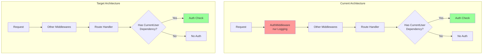
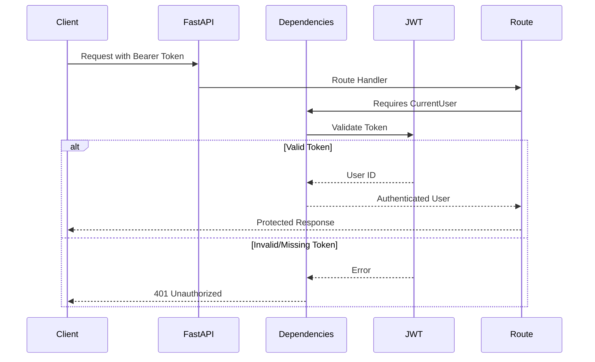
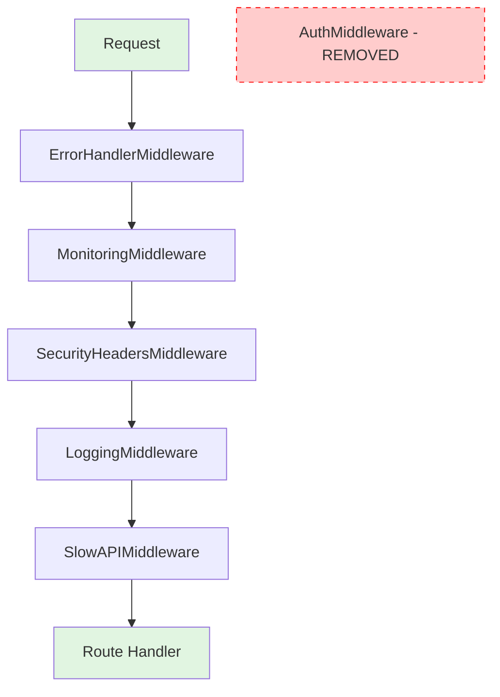

# Product Requirements Document: AuthMiddleware Cleanup

## 1. Executive Summary

Dieses PRD beschreibt die Bereinigung der verwirrenden AuthMiddleware in der Todo API. Die aktuelle Middleware suggeriert durch ihren Namen Authentifizierungs-Enforcement, führt aber nur Logging durch. Dies führt zu falschen Sicherheitsannahmen und redundantem Code. Die Lösung ist die vollständige Entfernung der Middleware zugunsten der bestehenden, korrekten Authentifizierung via FastAPI Dependencies.

## 2. Problem & Solution

### Problem Statement

Die `AuthMiddleware` verursacht folgende Probleme:

1. **Irreführender Name**: Suggeriert Authentifizierungs-Enforcement
2. **Falsche Sicherheitsannahmen**: Entwickler könnten denken, alle Routen sind geschützt
3. **Redundantes Logging**: Funktionalität bereits in LoggingMiddleware vorhanden
4. **Architektur-Inkonsistenz**: Authentifizierung erfolgt korrekt via Dependencies

### Solution Overview

**Empfohlene Lösung**: Vollständige Entfernung der AuthMiddleware

- Klare Architektur ohne verwirrende Komponenten
- Authentifizierung ausschließlich via FastAPI Dependencies
- Kein redundanter Code
- Explizite Sicherheit pro Route

## 3. User Stories

### Epic: Middleware-Bereinigung für klare Authentifizierungs-Architektur

#### Story 1: Backend-Entwickler Klarheit
**Als** Backend-Entwickler  
**möchte ich** eine eindeutige Authentifizierungs-Architektur  
**damit** ich sofort verstehe, wie Routen geschützt werden

**Acceptance Criteria:**
- [ ] Keine irreführenden Middleware-Namen
- [ ] Klare Dokumentation der Auth-Pattern
- [ ] Einheitliche Authentifizierung via Dependencies
- [ ] Keine doppelten Auth-Mechanismen

#### Story 2: Security Engineer Transparenz
**Als** Security Engineer  
**möchte ich** explizite Route-Sicherheit  
**damit** ich den Schutzstatus jeder Route eindeutig erkennen kann

**Acceptance Criteria:**
- [ ] Auth-Requirements pro Route explizit sichtbar
- [ ] Keine impliziten Sicherheitsannahmen
- [ ] Audit-fähige Sicherheitskonfiguration
- [ ] Kein "Security by Obscurity"

#### Story 3: DevOps Wartbarkeit
**Als** DevOps Engineer  
**möchte ich** minimale, klare Middleware-Konfiguration  
**damit** die Anwendung einfach zu debuggen und warten ist

**Acceptance Criteria:**
- [ ] Reduzierte Middleware-Komplexität
- [ ] Klare Fehlerquellen bei Auth-Problemen
- [ ] Vereinfachtes Logging ohne Duplikate
- [ ] Performance durch weniger Middleware-Layers

## 4. Technical Architecture

### Current vs. Target Architecture



### Authentication Flow (Unchanged)



### Middleware Stack After Cleanup



## 5. Implementation Details

### 5.1 Code Changes

#### Step 1: Remove AuthMiddleware from main.py
```python
# app/main.py
# REMOVE this line:
# from app.middleware.auth import AuthMiddleware

# REMOVE this line from middleware setup:
# app.add_middleware(AuthMiddleware)
```

#### Step 2: Delete AuthMiddleware file
```bash
rm app/middleware/auth.py
```

#### Step 3: Update imports in tests
```python
# Any test files importing AuthMiddleware
# Remove the import and related tests
```

### 5.2 Documentation Updates

#### Update README.md
```markdown
## Authentication

The Todo API uses JWT-based authentication implemented via FastAPI dependencies.

### How it works:
1. Obtain a token via `/api/v1/auth/login`
2. Include token in requests: `Authorization: Bearer <token>`
3. Protected routes use `CurrentUser` dependency

### Example:
```python
from app.dependencies import CurrentUser

# Protected route
@router.get("/protected")
async def protected_route(current_user: CurrentUser):
    return {"user_id": current_user}

# Public route
@router.get("/public")
async def public_route():
    return {"message": "No auth required"}
```
```

### 5.3 Migration Steps

1. **Identify AuthMiddleware usage**
   ```bash
   grep -r "AuthMiddleware" app/ tests/
   ```

2. **Check for custom logging dependencies**
   - Verify LoggingMiddleware captures auth info if needed
   - Add auth logging to LoggingMiddleware if required

3. **Remove middleware**
   - Delete import from main.py
   - Remove middleware registration
   - Delete auth.py file

4. **Update tests**
   - Remove AuthMiddleware-specific tests
   - Ensure auth tests still pass

## 6. Testing Strategy

### 6.1 Pre-Cleanup Tests
```python
# Verify current auth behavior
def test_auth_still_works_without_middleware():
    """Ensure removing AuthMiddleware doesn't break auth."""
    # Test protected endpoints
    # Test public endpoints
    # Test invalid tokens
```

### 6.2 Post-Cleanup Verification
```python
# tests/test_middleware_cleanup.py
def test_no_auth_middleware():
    """Ensure AuthMiddleware is removed."""
    from app.main import app
    
    middleware_names = [m.__class__.__name__ for m in app.middleware]
    assert "AuthMiddleware" not in middleware_names

def test_auth_via_dependencies():
    """Ensure auth still works via dependencies."""
    # Test with valid token
    # Test without token
    # Test with invalid token
```

### 6.3 Logging Verification
```python
def test_auth_logging_preserved():
    """Ensure auth events are still logged."""
    # Check LoggingMiddleware captures auth info
    # Verify no duplicate logging
```

## 7. Rollback Plan

Falls unerwartete Probleme auftreten:

1. **Immediate Rollback**
   ```bash
   git revert <commit-hash>
   ```

2. **Quick Fix**
   - Re-add AuthMiddleware temporarily
   - Investigate missing functionality
   - Plan proper migration

3. **Monitoring**
   - Check for increased 401 errors
   - Monitor logging completeness
   - Verify no security regressions

## 8. Risks & Mitigations

### Risk Matrix

| Risk | Probability | Impact | Mitigation |
|------|------------|--------|------------|
| Lost auth logging | Low | Low | Verify LoggingMiddleware coverage |
| Developer confusion | Medium | Low | Clear documentation & communication |
| Hidden dependencies | Low | Medium | Thorough testing before removal |
| Performance impact | Very Low | Low | Fewer middlewares = better performance |

### Specific Mitigations

1. **Lost Logging**
   - Audit current AuthMiddleware logs
   - Ensure LoggingMiddleware captures same info
   - Add specific auth logging if needed

2. **Developer Communication**
   - Update team documentation
   - Code review with team
   - Architecture decision record (ADR)

## 9. Success Metrics

### Immediate (Day 1)
- [ ] All tests pass after removal
- [ ] No auth-related errors in production
- [ ] Middleware stack simplified

### Short-term (Week 1)
- [ ] 0 auth-related incidents
- [ ] No developer confusion reports
- [ ] Improved startup time (fewer middlewares)

### Long-term (Month 1)
- [ ] Reduced maintenance burden
- [ ] Clearer architecture in code reviews
- [ ] No security audit findings related to auth confusion

## 10. Implementation Checklist

### Phase 1: Preparation
- [ ] Review current AuthMiddleware usage
- [ ] Identify any custom logging requirements
- [ ] Create backup branch
- [ ] Write removal tests

### Phase 2: Implementation
- [ ] Remove AuthMiddleware import from main.py
- [ ] Remove middleware registration
- [ ] Delete app/middleware/auth.py
- [ ] Update any test imports
- [ ] Run full test suite

### Phase 3: Verification
- [ ] Deploy to development environment
- [ ] Test all auth scenarios
- [ ] Verify logging completeness
- [ ] Check performance metrics

### Phase 4: Documentation
- [ ] Update README
- [ ] Create ADR (Architecture Decision Record)
- [ ] Update API documentation
- [ ] Notify team of changes

## Appendix A: Architecture Decision Record

### Title: Remove AuthMiddleware in favor of Dependency-based Auth

**Status**: Proposed

**Context**: AuthMiddleware creates confusion by suggesting auth enforcement while only providing logging.

**Decision**: Remove AuthMiddleware entirely, relying on FastAPI's dependency injection for auth.

**Consequences**:
- **Positive**: Clearer architecture, less code, better performance
- **Negative**: Need to ensure logging requirements are met elsewhere

## Appendix B: Alternative Approaches Considered

### Option 2: Rename to AuthLoggingMiddleware
- **Pros**: Preserves current functionality
- **Cons**: Still redundant with LoggingMiddleware

### Option 3: Implement Real Auth Enforcement
- **Pros**: Name matches functionality
- **Cons**: Duplicates dependency logic, against FastAPI patterns

**Conclusion**: Option 1 (complete removal) is the cleanest solution.