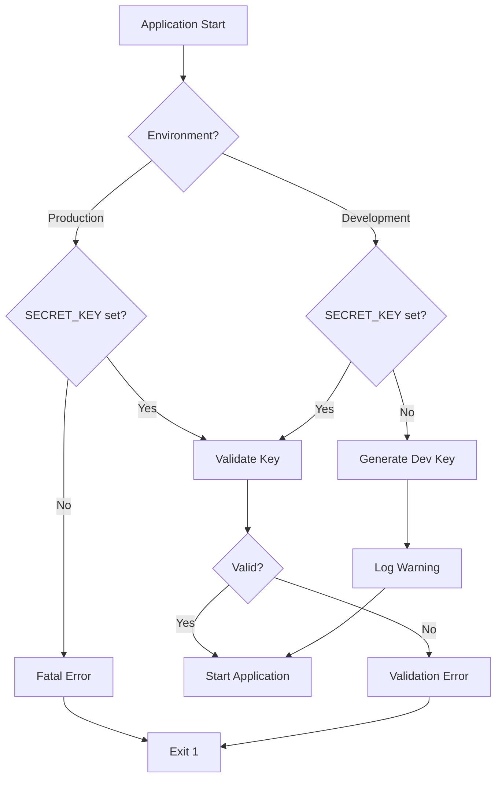
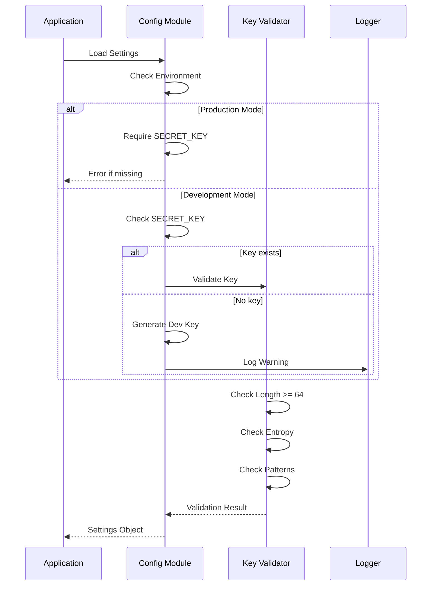
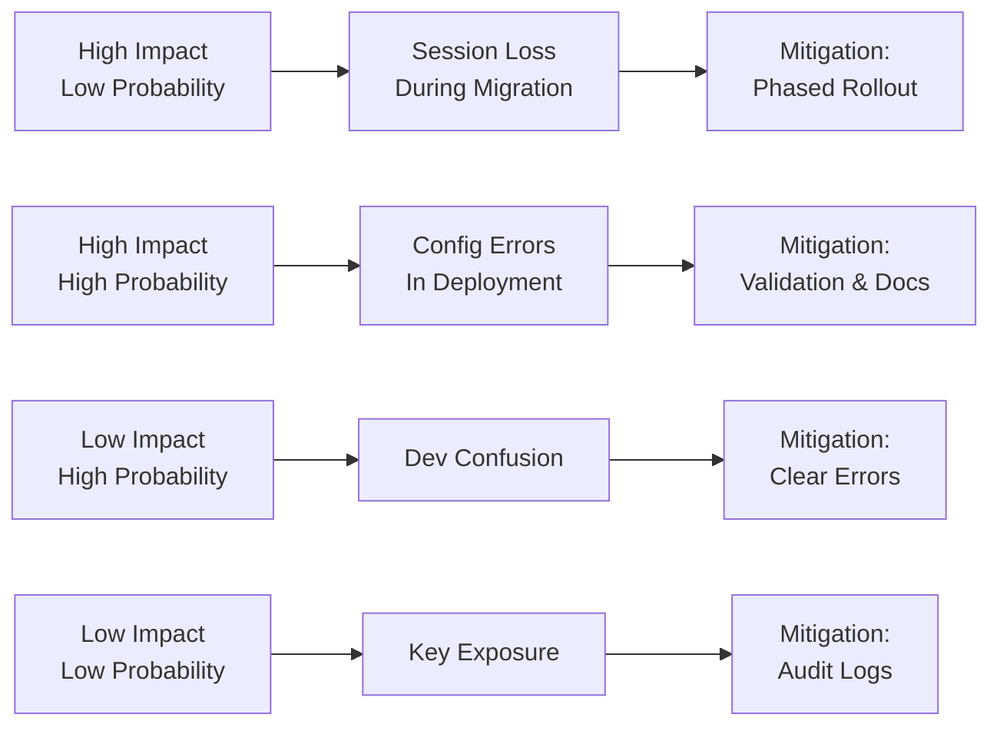
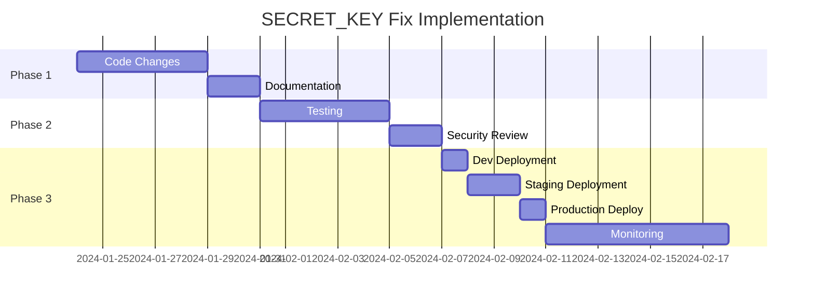

# Product Requirements Document: SECRET_KEY Security Fix

## 1. Executive Summary

Dieses PRD beschreibt die Implementierung einer sicheren SECRET_KEY-Verwaltung für die Todo API. Das aktuelle System generiert bei jedem Neustart einen neuen JWT-Schlüssel, was zu Session-Verlusten und Sicherheitsrisiken führt. Die Lösung umfasst eine sichere Konfigurationsstrategie mit Umgebungsvariablen, Validierung und Deployment-Anpassungen.

## 2. Problem & Solution

### Problem Statement
- **Aktueller Zustand**: Die Anwendung generiert bei fehlender Umgebungsvariable automatisch einen neuen SECRET_KEY
- **Auswirkungen**: 
  - Alle JWT-Tokens werden bei Neustart ungültig
  - Nutzer müssen sich neu einloggen
  - Potentielles Sicherheitsrisiko bei bekanntem Default-Verhalten
  - Produktionsausfälle möglich

### Solution Overview
Implementierung einer robusten SECRET_KEY-Verwaltung mit:
- Erzwingung von Umgebungsvariablen in Produktion
- Sichere Key-Generierung für Entwicklung
- Validierung und Monitoring
- Migration bestehender Deployments

## 3. User Stories

### Epic: Sichere JWT-Schlüsselverwaltung

#### Story 1: Entwickler-Setup
**Als** Entwickler  
**möchte ich** eine klare Anleitung zur SECRET_KEY-Konfiguration  
**damit** ich sicher lokal entwickeln kann

**Acceptance Criteria:**
- [ ] Automatische Warnung bei fehlendem SECRET_KEY
- [ ] Generierung eines Development-Keys mit Warnung
- [ ] Dokumentation im README
- [ ] .env.example mit Beispiel

#### Story 2: DevOps-Deployment  
**Als** DevOps Engineer  
**möchte ich** erzwungene SECRET_KEY-Konfiguration  
**damit** keine unsicheren Deployments möglich sind

**Acceptance Criteria:**
- [ ] Anwendung startet nicht ohne SECRET_KEY in Produktion
- [ ] Klare Fehlermeldung mit Anleitung
- [ ] Docker-Compose Validierung
- [ ] Kubernetes Secret Support

#### Story 3: Sicherheitsaudit
**Als** Security Engineer  
**möchte ich** SECRET_KEY-Validierung und Monitoring  
**damit** schwache Keys erkannt werden

**Acceptance Criteria:**
- [ ] Mindestlänge 64 Zeichen
- [ ] Entropie-Check
- [ ] Keine weak patterns
- [ ] Audit-Logging

## 4. Technical Architecture

### Configuration Flow


### Key Validation Process


## 5. Implementation Details

### 5.1 Configuration Changes

#### app/config.py Modifications
```python
class Settings(BaseSettings):
    # Entfernen des default_factory
    secret_key: SecretStr = Field(
        description="JWT secret key - REQUIRED in production"
    )
    
    # Neue Felder
    environment: str = Field(default="development")
    require_secure_key: bool = Field(default=True)
    
    @model_validator(mode='after')
    def validate_secret_key_requirement(self) -> 'Settings':
        """Ensure SECRET_KEY is set in production."""
        if self.environment == "production":
            if not self.secret_key:
                raise ValueError(
                    "SECRET_KEY is required in production environment. "
                    "Set it via environment variable."
                )
        return self
    
    @field_validator("secret_key", mode="after")
    @classmethod
    def validate_secret_key_strength(cls, v: SecretStr) -> SecretStr:
        """Enhanced validation with detailed feedback."""
        if not v:
            if os.getenv("ENVIRONMENT", "development") == "production":
                raise ValueError("SECRET_KEY is required in production")
            # Development fallback
            logger.warning(
                "No SECRET_KEY set - generating temporary key for development. "
                "This is NOT secure for production!"
            )
            return SecretStr(secrets.token_urlsafe(64))
        
        # Existing validation logic...
        return v
```

### 5.2 Startup Validation

#### app/main.py Enhancement
```python
@asynccontextmanager
async def lifespan(app: FastAPI) -> AsyncGenerator[None, None]:
    """Enhanced lifecycle with security checks."""
    logger.info("Starting up Todo API...")
    
    # Security validation
    if settings.environment == "production":
        if not verify_production_config():
            logger.critical("Production configuration validation failed!")
            raise SystemExit(1)
    
    # Existing startup code...
    yield
    
    # Existing shutdown code...

def verify_production_config() -> bool:
    """Verify critical production settings."""
    checks = {
        "SECRET_KEY": bool(settings.secret_key),
        "DATABASE_URL": bool(settings.database_url),
        "CORS_ORIGINS": settings.backend_cors_origins != ["*"],
    }
    
    failed = [k for k, v in checks.items() if not v]
    if failed:
        logger.error(f"Production config missing: {', '.join(failed)}")
        return False
    
    return True
```

### 5.3 Development Helper

#### scripts/generate_secret_key.py
```python
#!/usr/bin/env python3
"""Generate secure SECRET_KEY for Todo API."""
import secrets
import sys

def generate_key(length: int = 64) -> str:
    """Generate cryptographically secure key."""
    return secrets.token_urlsafe(length)

def main():
    print("🔐 Todo API Secret Key Generator")
    print("-" * 40)
    
    key = generate_key()
    
    print(f"\nGenerated SECRET_KEY:\n{key}\n")
    print("Add to your .env file:")
    print(f'SECRET_KEY="{key}"')
    print("\n⚠️  Keep this key secret and secure!")
    
if __name__ == "__main__":
    main()
```

## 6. Deployment Configuration

### 6.1 Docker Compose Updates

#### docker-compose.yml
```yaml
services:
  api:
    environment:
      - ENVIRONMENT=production
      - SECRET_KEY=${SECRET_KEY:?SECRET_KEY is required}
    env_file:
      - .env.production
```

#### docker-compose.dev.yml
```yaml
services:
  api:
    environment:
      - ENVIRONMENT=development
      - SECRET_KEY=${SECRET_KEY:-}  # Optional in dev
```

### 6.2 Kubernetes Configuration

#### k8s/secrets.yaml
```yaml
apiVersion: v1
kind: Secret
metadata:
  name: todo-api-secrets
type: Opaque
stringData:
  SECRET_KEY: "your-base64-encoded-key"
```

#### k8s/deployment.yaml
```yaml
spec:
  containers:
  - name: todo-api
    env:
    - name: ENVIRONMENT
      value: "production"
    - name: SECRET_KEY
      valueFrom:
        secretKeyRef:
          name: todo-api-secrets
          key: SECRET_KEY
```

## 7. Migration Strategy

### Phase 1: Code Updates (Week 1)
1. Implement configuration changes
2. Add validation logic
3. Update documentation
4. Create helper scripts

### Phase 2: Testing (Week 2)
1. Unit tests for validation
2. Integration tests for startup
3. Deployment tests
4. Security audit

### Phase 3: Staged Rollout (Week 3-4)
1. Deploy to development
2. Deploy to staging with monitoring
3. Production deployment with rollback plan
4. Monitor for issues

## 8. Risks & Mitigations

### Risk Matrix


### Specific Mitigations

1. **Session Loss During Migration**
   - Announce maintenance window
   - Implement grace period
   - Consider dual-key support temporarily

2. **Configuration Errors**
   - Pre-deployment validation script
   - Clear error messages
   - Rollback procedures

3. **Developer Confusion**
   - Enhanced documentation
   - Setup wizard script
   - Warning messages in dev mode

## 9. Success Metrics

### Technical Metrics
- [ ] 0 production starts without SECRET_KEY
- [ ] 100% of deployments pass validation
- [ ] <1% increase in startup time
- [ ] 0 security incidents related to keys

### User Impact Metrics
- [ ] 0 unexpected logouts post-deployment
- [ ] <5 support tickets about setup
- [ ] 100% of dev team successfully onboarded

### Security Metrics
- [ ] All production keys meet strength requirements
- [ ] Audit log captures all key-related events
- [ ] Quarterly key rotation implemented

## 10. Documentation Updates

### README.md Addition
```markdown
## 🔐 Security Configuration

### SECRET_KEY Setup (Required for Production)

The SECRET_KEY is critical for JWT token security. 

**Generate a secure key:**
```bash
python scripts/generate_secret_key.py
```

**Set in environment:**
```bash
# .env file
SECRET_KEY="your-generated-64-character-key"
```

**Production Requirements:**
- Minimum 64 characters
- High entropy (no patterns)
- Unique per environment
- Never commit to git
```

### Operations Guide
- Key rotation procedures
- Emergency key replacement
- Monitoring setup
- Incident response

## 11. Testing Strategy

### Unit Tests
```python
def test_production_requires_secret_key():
    """Production must fail without SECRET_KEY."""
    with pytest.raises(ValueError, match="SECRET_KEY is required"):
        Settings(environment="production", secret_key=None)

def test_development_generates_warning():
    """Development should warn but continue."""
    with pytest.warns(SecurityWarning):
        settings = Settings(environment="development", secret_key=None)
        assert settings.secret_key is not None
```

### Integration Tests
- Deployment validation
- Container startup tests
- Key rotation scenarios
- Error message verification

## 12. Timeline



## Appendix A: Security Best Practices

1. **Key Generation**
   - Use cryptographically secure random
   - Minimum 256 bits of entropy
   - Regular rotation schedule

2. **Key Storage**
   - Environment variables for containers
   - Secret management systems for cloud
   - Never in code or config files

3. **Key Rotation**
   - Quarterly rotation minimum
   - Dual-key support during transition
   - Automated rotation preferred

## Appendix B: Emergency Procedures

### Key Compromise Response
1. Generate new key immediately
2. Deploy with new key
3. Force re-authentication of all users
4. Audit logs for suspicious activity
5. Security incident report

### Rollback Plan
1. Keep previous config available
2. Monitor error rates
3. Quick rollback capability
4. Communication plan ready