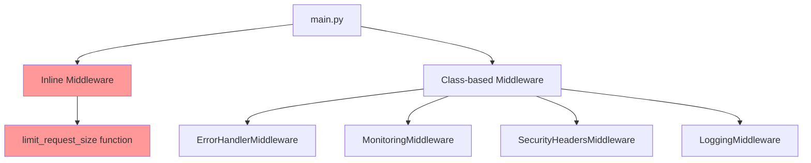
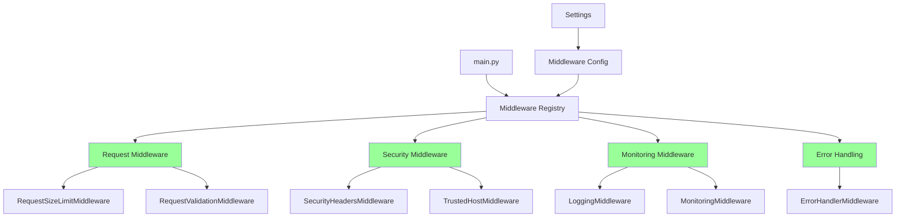
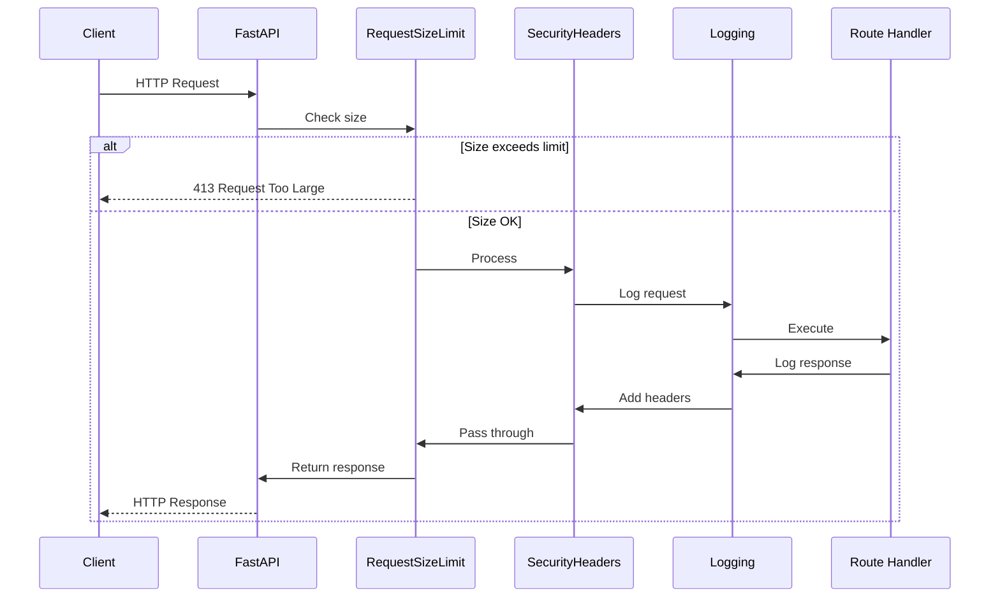
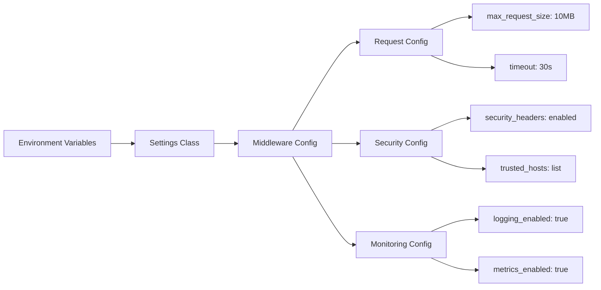
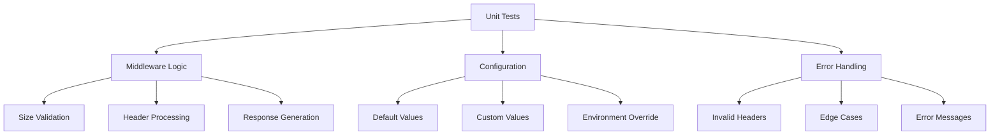
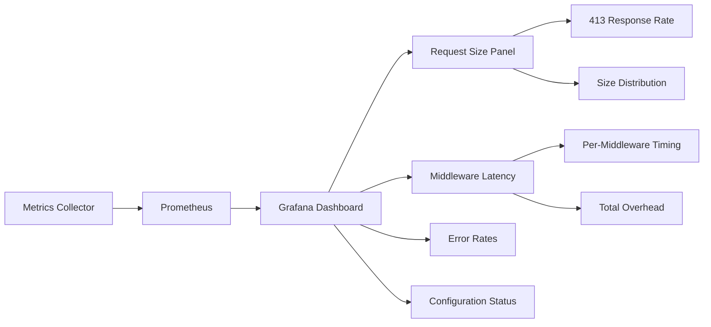
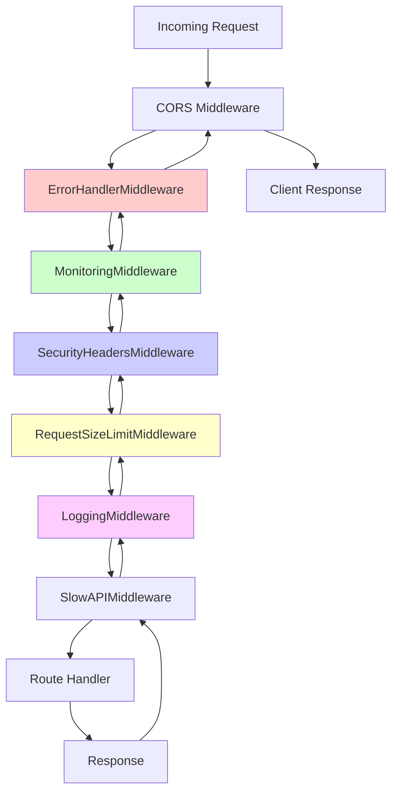

# Product Requirements Document: Middleware Extraction to Proper Classes

## 1. Executive Summary

Dieses PRD beschreibt die Refaktorierung von inline-definierter Middleware in der Todo API zu eigenständigen, wiederverwendbaren Klassen. Aktuell wird die Request Size Limiting Middleware direkt in `main.py` als inline-Funktion implementiert, was zu schlechter Testbarkeit, fehlender Wiederverwendbarkeit und unübersichtlicher Code-Organisation führt. Die Lösung strukturiert alle Middleware-Komponenten in dedizierte Klassen mit klarer Kapselung und Konfigurierbarkeit.

## 2. Problem & Solution

### Problem Statement

Die aktuelle Implementierung hat mehrere strukturelle Schwächen:

1. **Inline Middleware in main.py**
   - Request Size Limiting als einfache Funktion
   - Direkt mit `@app.middleware("http")` dekoriert
   - Keine Klassen-Kapselung

2. **Inkonsistente Middleware-Patterns**
   - Einige Middleware nutzen Klassen (SecurityHeadersMiddleware)
   - Andere sind inline definiert (limit_request_size)
   - Keine einheitliche Struktur

3. **Wartbarkeits-Probleme**
   - Schwer zu testen ohne vollständige App
   - Konfiguration direkt im Code
   - Keine Wiederverwendbarkeit

### Solution Overview

Implementierung eines konsistenten Middleware-Systems:
- Alle Middleware als eigenständige Klassen
- Einheitliche Konfiguration über Settings
- Vollständige Testabdeckung
- Klare Trennung von Verantwortlichkeiten

## 3. User Stories

### Epic: Strukturierte Middleware-Architektur

#### Story 1: Entwickler Middleware-Management
**Als** Backend-Entwickler  
**möchte ich** alle Middleware als Klassen definiert haben  
**damit** ich sie isoliert testen und wiederverwenden kann

**Acceptance Criteria:**
- [ ] Alle inline Middleware in Klassen extrahiert
- [ ] Einheitliches Interface für alle Middleware
- [ ] Konfiguration über Konstruktor-Parameter
- [ ] Dokumentation für jede Middleware-Klasse

#### Story 2: DevOps Middleware-Konfiguration
**Als** DevOps Engineer  
**möchte ich** Middleware über Umgebungsvariablen konfigurieren  
**damit** ich Verhalten ohne Code-Änderungen anpassen kann

**Acceptance Criteria:**
- [ ] Request Size Limit konfigurierbar
- [ ] Middleware aktivierbar/deaktivierbar
- [ ] Konfiguration in Settings zentralisiert
- [ ] Dokumentation der Konfigurationsoptionen

#### Story 3: QA Middleware-Testing
**Als** QA Engineer  
**möchte ich** isolierte Tests für jede Middleware schreiben  
**damit** ich Verhalten unabhängig verifizieren kann

**Acceptance Criteria:**
- [ ] Unit-Tests für jede Middleware-Klasse
- [ ] Integration-Tests für Middleware-Stack
- [ ] Test-Coverage > 90%
- [ ] Mock-Support für Dependencies

## 4. Technical Architecture

### Current Architecture



### Target Architecture



### Middleware Execution Flow



### Configuration Architecture



## 5. Implementation Details

### 5.1 Request Size Limit Middleware

#### Create app/middleware/request.py
```python
"""Request-related middleware."""
import logging
from typing import Optional

from fastapi import Request, Response
from fastapi.responses import JSONResponse
from starlette.middleware.base import BaseHTTPMiddleware
from starlette.types import ASGIApp

from app.config import settings

logger = logging.getLogger(__name__)


class RequestSizeLimitMiddleware(BaseHTTPMiddleware):
    """Middleware to limit request body size."""
    
    def __init__(
        self, 
        app: ASGIApp,
        max_size: Optional[int] = None,
        error_message: str = "Request body too large",
        include_max_size_in_error: bool = True
    ):
        """
        Initialize the middleware.
        
        Args:
            app: The ASGI application
            max_size: Maximum request size in bytes (default from settings)
            error_message: Custom error message
            include_max_size_in_error: Include max size in error response
        """
        super().__init__(app)
        self.max_size = max_size or settings.max_request_size
        self.error_message = error_message
        self.include_max_size_in_error = include_max_size_in_error
    
    async def dispatch(self, request: Request, call_next):
        """Check request size before processing."""
        content_length = request.headers.get("content-length")
        
        if content_length:
            try:
                size = int(content_length)
                if size > self.max_size:
                    logger.warning(
                        f"Request size {size} exceeds limit {self.max_size} "
                        f"from {request.client.host}"
                    )
                    
                    error_detail = {
                        "detail": self.error_message,
                        "type": "request_too_large"
                    }
                    
                    if self.include_max_size_in_error:
                        error_detail["max_size_bytes"] = self.max_size
                        error_detail["max_size_mb"] = round(self.max_size / 1024 / 1024, 2)
                    
                    return JSONResponse(
                        status_code=413,
                        content=error_detail
                    )
            except ValueError:
                logger.error(f"Invalid Content-Length header: {content_length}")
                return JSONResponse(
                    status_code=400,
                    content={"detail": "Invalid Content-Length header"}
                )
        
        response = await call_next(request)
        return response


class RequestTimeoutMiddleware(BaseHTTPMiddleware):
    """Middleware to enforce request timeouts."""
    
    def __init__(
        self,
        app: ASGIApp,
        timeout: Optional[int] = None
    ):
        """
        Initialize the middleware.
        
        Args:
            app: The ASGI application
            timeout: Request timeout in seconds
        """
        super().__init__(app)
        self.timeout = timeout or settings.request_timeout
    
    async def dispatch(self, request: Request, call_next):
        """Enforce timeout on request processing."""
        # Implementation would use asyncio.timeout
        # Simplified for PRD
        response = await call_next(request)
        return response
```

### 5.2 Configuration Updates

#### Update app/config.py
```python
class Settings(BaseSettings):
    # ... existing settings ...
    
    # Middleware Configuration
    middleware_enabled: bool = Field(
        default=True,
        description="Enable/disable all custom middleware"
    )
    
    # Request Middleware Settings
    max_request_size: int = Field(
        default=10 * 1024 * 1024,  # 10MB
        description="Maximum request body size in bytes",
        ge=1024,  # Minimum 1KB
        le=100 * 1024 * 1024  # Maximum 100MB
    )
    
    request_timeout: int = Field(
        default=30,
        description="Request timeout in seconds",
        ge=1,
        le=300
    )
    
    request_size_error_message: str = Field(
        default="Request body too large",
        description="Custom error message for oversized requests"
    )
    
    # Security Middleware Settings
    security_headers_enabled: bool = Field(
        default=True,
        description="Enable security headers middleware"
    )
    
    trusted_hosts: list[str] = Field(
        default_factory=lambda: ["localhost", "127.0.0.1"],
        description="List of trusted host headers"
    )
    
    # Monitoring Middleware Settings
    request_logging_enabled: bool = Field(
        default=True,
        description="Enable request/response logging"
    )
    
    metrics_collection_enabled: bool = Field(
        default=True,
        description="Enable metrics collection"
    )
```

### 5.3 Middleware Registry

#### Create app/middleware/registry.py
```python
"""Middleware registry and configuration."""
from typing import Type, Optional
from dataclasses import dataclass

from fastapi import FastAPI
from starlette.middleware.base import BaseHTTPMiddleware

from app.config import settings
from app.middleware.request import RequestSizeLimitMiddleware, RequestTimeoutMiddleware
from app.middleware.security import SecurityHeadersMiddleware, TrustedHostMiddleware
from app.middleware.logging import LoggingMiddleware
from app.middleware.monitoring import MonitoringMiddleware
from app.middleware.error_handler import ErrorHandlerMiddleware


@dataclass
class MiddlewareConfig:
    """Configuration for a middleware component."""
    middleware_class: Type[BaseHTTPMiddleware]
    enabled: bool = True
    config: dict = None
    order: int = 0  # Lower numbers execute first
    
    def __post_init__(self):
        if self.config is None:
            self.config = {}


class MiddlewareRegistry:
    """Central registry for application middleware."""
    
    def __init__(self):
        self.middleware_configs = []
    
    def register(self, config: MiddlewareConfig):
        """Register a middleware configuration."""
        self.middleware_configs.append(config)
        # Sort by order
        self.middleware_configs.sort(key=lambda x: x.order)
    
    def apply_to_app(self, app: FastAPI):
        """Apply all registered middleware to the app."""
        # Apply in reverse order (last registered executes first)
        for config in reversed(self.middleware_configs):
            if config.enabled and settings.middleware_enabled:
                app.add_middleware(
                    config.middleware_class,
                    **config.config
                )


def create_middleware_registry() -> MiddlewareRegistry:
    """Create and configure the middleware registry."""
    registry = MiddlewareRegistry()
    
    # Error handling (should be outermost)
    registry.register(MiddlewareConfig(
        middleware_class=ErrorHandlerMiddleware,
        order=10,
        enabled=True
    ))
    
    # Monitoring
    registry.register(MiddlewareConfig(
        middleware_class=MonitoringMiddleware,
        order=20,
        enabled=settings.metrics_collection_enabled
    ))
    
    # Security headers
    registry.register(MiddlewareConfig(
        middleware_class=SecurityHeadersMiddleware,
        order=30,
        enabled=settings.security_headers_enabled
    ))
    
    # Request size limiting
    registry.register(MiddlewareConfig(
        middleware_class=RequestSizeLimitMiddleware,
        order=40,
        enabled=True,
        config={
            "max_size": settings.max_request_size,
            "error_message": settings.request_size_error_message,
            "include_max_size_in_error": True
        }
    ))
    
    # Request logging
    registry.register(MiddlewareConfig(
        middleware_class=LoggingMiddleware,
        order=50,
        enabled=settings.request_logging_enabled
    ))
    
    return registry
```

### 5.4 Updated main.py

#### Refactored app/main.py
```python
"""Main FastAPI application."""
# ... imports ...

from app.middleware.registry import create_middleware_registry

# ... existing code ...

# Create FastAPI application
app = FastAPI(
    title=settings.app_name,
    version="0.1.0",
    description="A simple and robust Todo List Web API",
    openapi_url=f"{settings.api_v1_str}/openapi.json",
    docs_url=f"{settings.api_v1_str}/docs",
    redoc_url=f"{settings.api_v1_str}/redoc",
    lifespan=lifespan,
)

# Setup rate limiting
setup_rate_limiting(app)

# Add CORS middleware (special case - needs to be before custom middleware)
app.add_middleware(
    CORSMiddleware,
    allow_origins=settings.backend_cors_origins,
    allow_credentials=True,
    allow_methods=["*"],
    allow_headers=["*"],
)

# Apply custom middleware via registry
middleware_registry = create_middleware_registry()
middleware_registry.apply_to_app(app)

# Add SlowAPI middleware (must be last)
app.add_middleware(SlowAPIMiddleware)

# Include routers
# ... rest of the file ...
```

### 5.5 Testing Infrastructure

#### Create tests/unit/middleware/test_request_middleware.py
```python
"""Tests for request middleware."""
import pytest
from fastapi import FastAPI, Request
from fastapi.testclient import TestClient

from app.middleware.request import RequestSizeLimitMiddleware


class TestRequestSizeLimitMiddleware:
    """Test cases for RequestSizeLimitMiddleware."""
    
    @pytest.fixture
    def app_with_middleware(self):
        """Create app with request size limit middleware."""
        app = FastAPI()
        app.add_middleware(
            RequestSizeLimitMiddleware,
            max_size=1024,  # 1KB for testing
            error_message="Test: Request too large"
        )
        
        @app.post("/test")
        async def test_endpoint(request: Request):
            body = await request.body()
            return {"size": len(body)}
        
        return app
    
    def test_request_within_limit(self, app_with_middleware):
        """Test request within size limit."""
        client = TestClient(app_with_middleware)
        response = client.post(
            "/test",
            content=b"x" * 500,  # 500 bytes
            headers={"Content-Length": "500"}
        )
        assert response.status_code == 200
        assert response.json() == {"size": 500}
    
    def test_request_exceeds_limit(self, app_with_middleware):
        """Test request exceeding size limit."""
        client = TestClient(app_with_middleware)
        response = client.post(
            "/test",
            content=b"x" * 2000,  # 2KB
            headers={"Content-Length": "2000"}
        )
        assert response.status_code == 413
        assert response.json()["detail"] == "Test: Request too large"
        assert response.json()["max_size_bytes"] == 1024
    
    def test_invalid_content_length(self, app_with_middleware):
        """Test invalid Content-Length header."""
        client = TestClient(app_with_middleware)
        response = client.post(
            "/test",
            content=b"test",
            headers={"Content-Length": "invalid"}
        )
        assert response.status_code == 400
        assert "Invalid Content-Length" in response.json()["detail"]
    
    def test_no_content_length(self, app_with_middleware):
        """Test request without Content-Length header."""
        client = TestClient(app_with_middleware)
        response = client.post("/test", json={"test": "data"})
        assert response.status_code == 200
```

## 6. Migration Guide

### Phase 1: Preparation (No Breaking Changes)
1. Create new middleware classes alongside existing code
2. Add configuration options to Settings
3. Write comprehensive tests for new middleware
4. Document new middleware patterns

### Phase 2: Gradual Migration
1. Replace inline middleware one at a time:
   - Start with RequestSizeLimitMiddleware
   - Test in development environment
   - Monitor for issues
2. Update monitoring to track middleware performance
3. Gather feedback from development team

### Phase 3: Cleanup
1. Remove old inline middleware code
2. Update all documentation
3. Ensure all middleware follows new pattern
4. Archive old code for reference

### Migration Checklist
```yaml
preparation:
  - [ ] Create middleware package structure
  - [ ] Implement RequestSizeLimitMiddleware
  - [ ] Add configuration to Settings
  - [ ] Write unit tests
  - [ ] Write integration tests
  - [ ] Document new patterns

migration:
  - [ ] Deploy to development
  - [ ] Replace inline middleware
  - [ ] Test all endpoints
  - [ ] Monitor performance
  - [ ] Update documentation

cleanup:
  - [ ] Remove old code
  - [ ] Update README
  - [ ] Training for team
  - [ ] Close migration tickets
```

## 7. Testing Strategy

### Unit Testing



### Integration Testing

```python
# Example integration test structure
class TestMiddlewareIntegration:
    """Test middleware working together."""
    
    def test_full_middleware_stack(self):
        """Test all middleware in correct order."""
        # 1. Create app with all middleware
        # 2. Send various requests
        # 3. Verify each middleware executed
        # 4. Check final response
    
    def test_middleware_ordering(self):
        """Test middleware execution order."""
        # Verify error handler wraps all
        # Verify security headers applied
        # Verify logging captures all
    
    def test_middleware_configuration(self):
        """Test middleware can be configured."""
        # Test enabling/disabling
        # Test configuration changes
        # Test environment overrides
```

## 8. Monitoring & Metrics

### Key Metrics

```yaml
middleware_metrics:
  request_size:
    - requests_blocked: "Count of 413 responses"
    - average_request_size: "Average size of requests"
    - max_request_size_seen: "Largest request attempted"
  
  performance:
    - middleware_latency: "Time spent in each middleware"
    - total_middleware_time: "Total middleware overhead"
    - middleware_errors: "Errors within middleware"
  
  configuration:
    - config_reloads: "Configuration changes"
    - middleware_enabled_status: "Which middleware are active"
```

### Monitoring Dashboard



## 9. Documentation Updates

### Developer Guide

```markdown
# Middleware Development Guide

## Creating New Middleware

1. Extend BaseHTTPMiddleware
2. Implement dispatch method
3. Add configuration to Settings
4. Register in MiddlewareRegistry
5. Write tests

## Example:
```python
from starlette.middleware.base import BaseHTTPMiddleware

class CustomMiddleware(BaseHTTPMiddleware):
    def __init__(self, app, config_value: str):
        super().__init__(app)
        self.config_value = config_value
    
    async def dispatch(self, request, call_next):
        # Pre-processing
        response = await call_next(request)
        # Post-processing
        return response
```

## Best Practices

1. Keep middleware focused on single responsibility
2. Make everything configurable
3. Handle errors gracefully
4. Log important events
5. Write comprehensive tests
```

## 10. Risks & Mitigations

### Risk Analysis

| Risk | Probability | Impact | Mitigation |
|------|------------|--------|------------|
| Breaking existing functionality | Low | High | Comprehensive testing, gradual rollout |
| Performance regression | Low | Medium | Benchmark before/after, monitoring |
| Configuration complexity | Medium | Low | Clear documentation, sensible defaults |
| Team adoption resistance | Low | Low | Training, clear benefits demonstration |

### Mitigation Details

1. **Testing Strategy**
   - 100% test coverage for new middleware
   - Integration tests for full stack
   - Performance benchmarks
   - Load testing

2. **Rollout Strategy**
   - Feature flags for new middleware
   - Gradual rollout per environment
   - Quick rollback capability
   - Monitoring at each stage

3. **Team Enablement**
   - Documentation first approach
   - Code review guidelines
   - Pair programming sessions
   - Knowledge sharing meetings

## 11. Success Metrics

### Immediate (Week 1)
- [ ] All inline middleware converted to classes
- [ ] 100% test coverage for middleware
- [ ] Zero regression bugs

### Short-term (Month 1)
- [ ] 50% reduction in middleware-related bugs
- [ ] All developers comfortable with new pattern
- [ ] Middleware development time reduced by 40%

### Long-term (Quarter 1)
- [ ] Middleware reused in other projects
- [ ] Standardized middleware library created
- [ ] 90% reduction in middleware maintenance time

## Implementation Checklist

### Phase 1: Infrastructure (4 hours)
- [ ] Create middleware/request.py module
- [ ] Create middleware/registry.py module
- [ ] Update Settings with middleware config
- [ ] Create base test fixtures

### Phase 2: Implementation (4 hours)
- [ ] Implement RequestSizeLimitMiddleware
- [ ] Implement RequestTimeoutMiddleware
- [ ] Implement MiddlewareRegistry
- [ ] Update main.py to use registry

### Phase 3: Testing (4 hours)
- [ ] Write unit tests for each middleware
- [ ] Write integration tests for stack
- [ ] Performance benchmarking
- [ ] Load testing

### Phase 4: Documentation (2 hours)
- [ ] Update developer guide
- [ ] Create middleware examples
- [ ] Update API documentation
- [ ] Create migration guide

### Phase 5: Deployment (2 hours)
- [ ] Deploy to development
- [ ] Test all endpoints
- [ ] Monitor metrics
- [ ] Gradual production rollout

## Appendix A: Middleware Execution Order



## Appendix B: Configuration Examples

```bash
# Development environment
MIDDLEWARE_ENABLED=true
MAX_REQUEST_SIZE=52428800  # 50MB for development
REQUEST_TIMEOUT=60
SECURITY_HEADERS_ENABLED=false  # Disabled for local dev
REQUEST_LOGGING_ENABLED=true
METRICS_COLLECTION_ENABLED=false

# Production environment
MIDDLEWARE_ENABLED=true
MAX_REQUEST_SIZE=10485760  # 10MB
REQUEST_TIMEOUT=30
SECURITY_HEADERS_ENABLED=true
REQUEST_LOGGING_ENABLED=true
METRICS_COLLECTION_ENABLED=true
TRUSTED_HOSTS=["api.example.com", "www.example.com"]
```

## Appendix C: Performance Benchmarks

```yaml
benchmark_expectations:
  baseline:
    avg_latency: 50ms
    p99_latency: 200ms
    throughput: 1000 req/s
  
  with_middleware:
    avg_latency: 52ms  # Max 4% increase
    p99_latency: 210ms  # Max 5% increase
    throughput: 980 req/s  # Max 2% decrease
  
  test_scenarios:
    - small_requests: 1KB payloads
    - medium_requests: 100KB payloads
    - large_requests: 10MB payloads
    - mixed_workload: realistic distribution
```