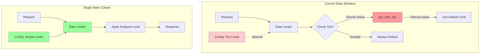
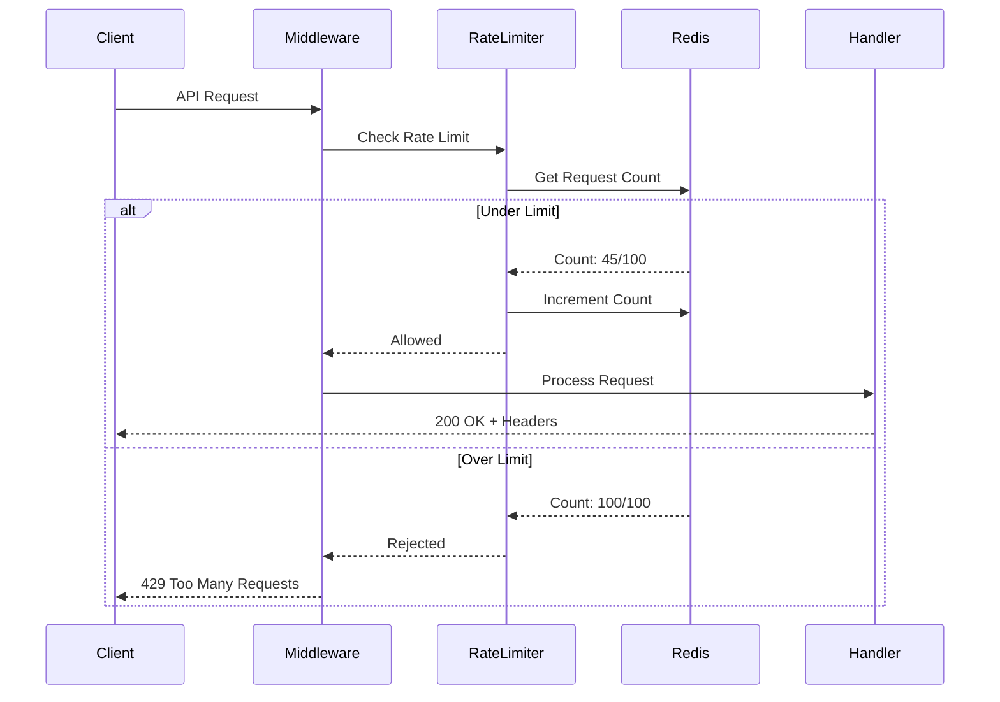
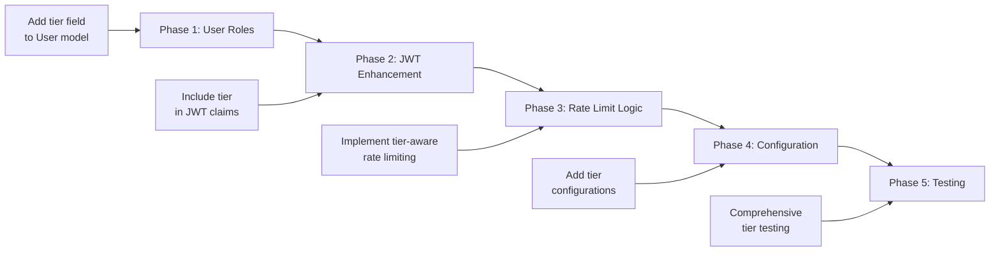

# Product Requirements Document: Tier-based Rate Limiting Cleanup

## 1. Executive Summary

Dieses PRD beschreibt die Bereinigung des unvollständigen Tier-based Rate Limiting Features in der Todo API. Die aktuelle Implementierung enthält nicht-funktionierenden Code mit TODO-Kommentaren und irreführende Konfigurationen. Die empfohlene Lösung ist die vollständige Entfernung des Features zugunsten eines sauberen, einheitlichen Rate Limiting Systems. Dies folgt dem YAGNI-Prinzip und ermöglicht eine spätere, saubere Implementierung bei tatsächlichem Bedarf.

## 2. Problem & Solution

### Problem Statement

Das aktuelle Tier-based Rate Limiting System hat folgende Probleme:

1. **Unvollständige Implementierung**
   - TODO-Kommentar zeigt bekannte Probleme
   - SlowAPI-Kompatibilitätsproblem ungelöst
   - Feature funktioniert nicht, Code ist aber vorhanden

2. **Irreführende Konfiguration**
   - .env.example enthält tier-spezifische Limits
   - Entwickler erwarten funktionierende Features
   - Konfiguration wird komplett ignoriert

3. **Technische Schuld**
   - Toter Code erhöht Komplexität
   - Wartungsaufwand ohne Nutzen
   - Potenzielle Fehlerquelle

### Solution Overview

**Empfohlene Lösung**: Vollständige Entfernung des Tier-based Features

- Entfernung aller tier-bezogenen Code-Teile
- Bereinigung der Konfiguration
- Klare Dokumentation des einheitlichen Rate Limiting
- Vorbereitung für zukünftige, saubere Implementierung

## 3. User Stories

### Epic: Rate Limiting System Bereinigung

#### Story 1: Entwickler-Klarheit
**Als** Backend-Entwickler  
**möchte ich** klare, funktionierende Rate Limiting Konfiguration  
**damit** ich verstehe, welche Limits tatsächlich gelten

**Acceptance Criteria:**
- [ ] Keine TODO-Kommentare im Rate Limiting Code
- [ ] Konfiguration entspricht tatsächlichem Verhalten
- [ ] Dokumentation zeigt aktuelle Limits
- [ ] Keine toten Code-Pfade

#### Story 2: DevOps-Konfiguration
**Als** DevOps Engineer  
**möchte ich** einfache, verlässliche Rate Limit Konfiguration  
**damit** ich Limits ohne Verwirrung anpassen kann

**Acceptance Criteria:**
- [ ] .env.example enthält nur funktionierende Optionen
- [ ] Keine tier-spezifischen Konfigurationen
- [ ] Klare Dokumentation der verfügbaren Limits
- [ ] Einfache Anpassung pro Endpoint

#### Story 3: API-Nutzer Transparenz
**Als** API-Nutzer  
**möchte ich** konsistente Rate Limits  
**damit** ich meine Anwendung entsprechend optimieren kann

**Acceptance Criteria:**
- [ ] Alle Nutzer haben gleiche Limits
- [ ] Rate Limit Headers korrekt gesetzt
- [ ] Dokumentation zeigt aktuelle Limits
- [ ] Keine Verwirrung über "Tiers"

## 4. Technical Architecture

### Current vs. Target State



### Rate Limiting Flow After Cleanup



## 5. Implementation Details

### 5.1 Code Changes

#### Step 1: Clean up rate_limit.py

```python
# app/middleware/rate_limit.py

# REMOVE get_user_tier function completely
# def get_user_tier(request: Request) -> str | None:
#     ...  # DELETE ALL

# SIMPLIFY create_endpoint_limiter
def create_endpoint_limiter(
    limit: str,
    key_func: Callable | None = None
) -> Callable:
    """
    Create a rate limiter for a specific endpoint.
    
    Args:
        limit: Rate limit string (e.g., "10/minute")
        key_func: Optional custom key function
    """
    return limiter.limit(limit, key_func=key_func or get_rate_limit_key)
```

#### Step 2: Update RateLimiters class

```python
# app/middleware/rate_limit.py

class RateLimiters:
    """Centralized rate limiters for different endpoints."""
    
    # Authentication endpoints
    auth_register = limiter.limit(
        lambda: settings.rate_limit_auth_register or "10/hour"
    )
    auth_login = limiter.limit(
        lambda: settings.rate_limit_auth_login or "5/minute"
    )
    
    # Todo endpoints (simplified)
    todo_create = limiter.limit("30/minute")
    todo_list = limiter.limit("60/minute")
    todo_get = limiter.limit("100/minute")
    todo_update = limiter.limit("30/minute")
    todo_delete = limiter.limit("20/minute")
```

#### Step 3: Clean up configuration

```python
# app/config.py

class Settings(BaseSettings):
    # Remove tier-specific settings
    # REMOVE: rate_limit_auth_register_admin
    # REMOVE: rate_limit_auth_login_premium
    # etc.
    
    # Keep only simple rate limits
    rate_limit_per_minute: int = 100
    rate_limit_per_hour: int = 1000
    
    # Endpoint-specific limits (non-tier)
    rate_limit_auth_register: str = "10/hour"
    rate_limit_auth_login: str = "5/minute"
```

#### Step 4: Update .env.example

```bash
# Rate Limiting Configuration
RATE_LIMIT_ENABLED=true
RATE_LIMIT_STRATEGY=moving-window
RATE_LIMIT_BURST_SIZE=10

# Default rate limits
RATE_LIMIT_PER_MINUTE=100
RATE_LIMIT_PER_HOUR=1000

# Authentication Rate Limits
RATE_LIMIT_AUTH_REGISTER=10/hour
RATE_LIMIT_AUTH_LOGIN=5/minute

# Todo Rate Limits
RATE_LIMIT_TODO_CREATE=30/minute
RATE_LIMIT_TODO_LIST=60/minute
RATE_LIMIT_TODO_GET=100/minute
RATE_LIMIT_TODO_UPDATE=30/minute
RATE_LIMIT_TODO_DELETE=20/minute

# REMOVED: All tier-specific configurations
```

### 5.2 Testing Updates

```python
# tests/test_rate_limiting.py

def test_no_tier_based_limiting():
    """Ensure tier-based limiting is removed."""
    from app.middleware.rate_limit import create_endpoint_limiter
    
    # Should not accept per_tier parameter
    with pytest.raises(TypeError):
        create_endpoint_limiter("10/minute", per_tier={"admin": "unlimited"})

def test_consistent_rate_limits():
    """All users get same rate limits."""
    # Test that different JWTs get same limits
    # No tier extraction should occur
```

### 5.3 Documentation Updates

#### README.md Update
```markdown
## Rate Limiting

The API implements rate limiting to prevent abuse and ensure fair usage.

### Current Limits

All authenticated users have the following limits:

| Endpoint Category | Limit |
|------------------|-------|
| Authentication | 5 requests/minute |
| Todo Operations | 60 requests/minute |
| Bulk Operations | 5 requests/minute |

### Configuration

Rate limits can be configured via environment variables:

```bash
RATE_LIMIT_PER_MINUTE=100
RATE_LIMIT_TODO_CREATE=30/minute
```

**Note**: The API currently uses uniform rate limiting for all users. 
Tier-based limiting may be implemented in future versions.
```

## 6. Migration Guide

### For Developers

1. **Remove tier expectations**
   - No more premium/admin rate limits
   - All users have same limits
   - Update client applications accordingly

2. **Configuration changes**
   - Remove tier-specific env variables
   - Use standard rate limit configs only

### For Operations

1. **Update deployments**
   - Remove tier-specific configurations
   - Update monitoring dashboards
   - Adjust alerting thresholds

## 7. Future Considerations

### If Tier-based Limiting is Needed



### Recommended Implementation Approach

1. **Database Schema**
   ```sql
   ALTER TABLE users ADD COLUMN tier VARCHAR(20) DEFAULT 'basic';
   ```

2. **JWT Claims**
   ```python
   {
       "sub": "user_id",
       "tier": "premium",
       "exp": 1234567890
   }
   ```

3. **Clean Architecture**
   - Separate tier logic from rate limiting
   - Use strategy pattern for different tiers
   - Comprehensive testing

## 8. Risks & Mitigations

### Risk Assessment

| Risk | Probability | Impact | Mitigation |
|------|------------|--------|------------|
| Breaking existing integrations | Low | Medium | Clear communication |
| Confusion about removed feature | Medium | Low | Documentation update |
| Future implementation complexity | Low | Medium | Clean removal now |

### Mitigation Strategies

1. **Communication Plan**
   - Announce removal in changelog
   - Update API documentation
   - Email notifications if needed

2. **Monitoring**
   - Track 429 response rates
   - Monitor for confusion in support
   - Be ready to clarify

## 9. Success Metrics

### Immediate (Day 1)
- [ ] All TODO comments removed
- [ ] Tests pass without tier logic
- [ ] Configuration simplified

### Short-term (Week 1)
- [ ] No increase in 429 errors
- [ ] No support tickets about tiers
- [ ] Clean code metrics improved

### Long-term (Month 1)
- [ ] Reduced maintenance burden
- [ ] Easier onboarding for new devs
- [ ] Ready for clean tier implementation if needed

## 10. Implementation Checklist

### Phase 1: Code Cleanup (1 hour)
- [ ] Remove `get_user_tier` function
- [ ] Simplify `create_endpoint_limiter`
- [ ] Clean up `RateLimiters` class
- [ ] Remove tier-related imports

### Phase 2: Configuration (30 minutes)
- [ ] Update `config.py` settings
- [ ] Clean `.env.example`
- [ ] Remove tier variables from deployments

### Phase 3: Testing (1 hour)
- [ ] Update rate limiting tests
- [ ] Remove tier-specific test cases
- [ ] Add tests for consistent limits
- [ ] Full test suite run

### Phase 4: Documentation (30 minutes)
- [ ] Update README.md
- [ ] Update API documentation
- [ ] Create migration notes
- [ ] Update inline code comments

### Phase 5: Deployment (1 hour)
- [ ] Deploy to development
- [ ] Verify rate limiting works
- [ ] Deploy to staging
- [ ] Production deployment

## Appendix A: Removed Code Reference

Document all removed code for future reference:

```python
# Removed Functions:
- get_user_tier()
- tier-aware rate limit logic

# Removed Configurations:
- RATE_LIMIT_*_PREMIUM
- RATE_LIMIT_*_ADMIN
- per_tier parameters

# Removed Tests:
- test_tier_based_rate_limiting()
- test_admin_unlimited_requests()
```

## Appendix B: Alternative Approaches

### Considered but Rejected:

1. **Fix SlowAPI Compatibility**
   - Too much effort for unused feature
   - May require SlowAPI fork

2. **Custom Rate Limiter**
   - Reinventing the wheel
   - Maintenance burden

3. **Keep Non-functional Code**
   - Violates clean code principles
   - Confuses developers

**Conclusion**: Clean removal is the best path forward.