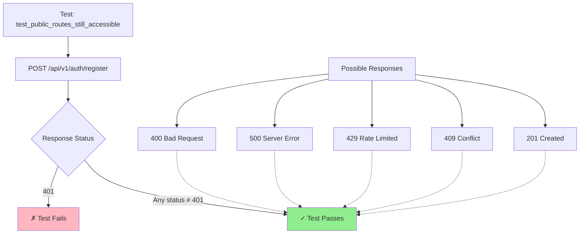
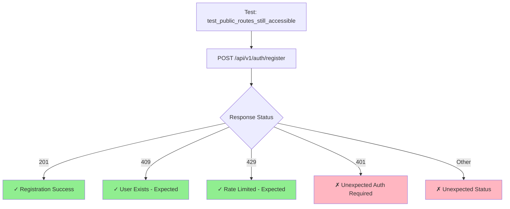
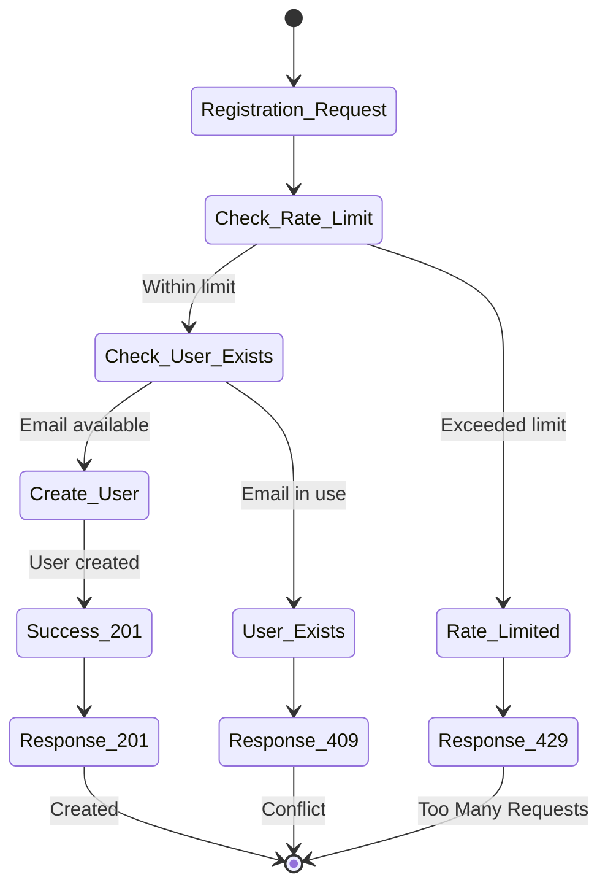

# Product Requirements Document: Registration Test Conflict Handling

## 1. Executive Summary

This PRD addresses the inadequate error handling in the registration test within `test_middleware_cleanup.py`. The current test only verifies that registration doesn't return 401 (Unauthorized), but fails to properly handle the expected 409 (Conflict) status when a user already exists. This improvement ensures comprehensive test coverage for all expected registration scenarios, making tests more reliable and maintainable.

## 2. Problem & Solution

### Problem Statement

The current test implementation has a critical flaw:

```python
# May fail due to existing user, but should not be 401
assert response.status_code != status.HTTP_401_UNAUTHORIZED
```

**Issues:**
1. **Incomplete Assertion**: Only checks what it shouldn't be, not what it should be
2. **Ignored Failure Mode**: Comment acknowledges potential conflict but doesn't handle it
3. **Rate Limit Blindness**: Doesn't account for 429 responses from rate limiting
4. **False Positives**: Test could pass with unexpected status codes (500, 400, etc.)

### Solution Overview

Implement explicit status code checking that accounts for all valid registration scenarios:
- Success (201 Created)
- User exists (409 Conflict)  
- Rate limited (429 Too Many Requests)

This ensures the test accurately validates the registration endpoint's behavior under all expected conditions.

## 3. User Stories

### Epic: Robust Test Coverage for Authentication Endpoints

#### Story 1: Developer Test Reliability
**As a** backend developer  
**I want** registration tests to handle all expected scenarios  
**So that** I can trust test results and catch real issues

**Acceptance Criteria:**
- [ ] Test explicitly checks for expected status codes
- [ ] All valid registration responses are handled
- [ ] Test failure indicates actual problems, not test flakiness
- [ ] Clear assertion messages explain expected behavior

#### Story 2: CI/CD Pipeline Stability
**As a** DevOps engineer  
**I want** tests to be deterministic and not flaky  
**So that** CI/CD pipelines don't fail due to test design issues

**Acceptance Criteria:**
- [ ] Tests handle rate limiting gracefully
- [ ] User existence conflicts don't cause false failures
- [ ] Test can run multiple times without cleanup issues
- [ ] No dependency on test execution order

#### Story 3: QA Test Maintenance
**As a** QA engineer  
**I want** clear test intentions and failure modes  
**So that** I can quickly diagnose and fix test issues

**Acceptance Criteria:**
- [ ] Comments explain all possible outcomes
- [ ] Status codes are documented with their meanings
- [ ] Test structure follows established patterns
- [ ] Easy to extend for new scenarios

## 4. Technical Architecture

### Current Test Flow



### Improved Test Flow



### Registration Endpoint Response Matrix



## 5. Implementation Details

### Updated Test Implementation

```python
@pytest.mark.asyncio
async def test_public_routes_still_accessible(self, client):
    """Ensure public routes remain accessible without authentication."""
    # Health check should be public
    response = await client.get("/health")
    assert response.status_code == status.HTTP_200_OK
    
    # Auth routes should be public
    response = await client.post(
        "/api/v1/auth/register",
        json={
            "username": "newuser",
            "email": "newuser@example.com",
            "password": "password123"
        }
    )
    
    # Registration can have multiple valid outcomes
    assert response.status_code in [
        status.HTTP_201_CREATED,      # Success: new user created
        status.HTTP_409_CONFLICT,     # Expected: user already exists
        status.HTTP_429_TOO_MANY_REQUESTS  # Expected: rate limited
    ], f"Unexpected status code: {response.status_code}. Response: {response.json()}"
    
    # Verify it's not requiring authentication
    assert response.status_code != status.HTTP_401_UNAUTHORIZED
```

### Alternative Implementation with Detailed Handling

```python
@pytest.mark.asyncio
async def test_public_routes_still_accessible(self, client):
    """Ensure public routes remain accessible without authentication."""
    # Health check should be public
    response = await client.get("/health")
    assert response.status_code == status.HTTP_200_OK
    
    # Test registration endpoint
    response = await client.post(
        "/api/v1/auth/register",
        json={
            "username": "newuser",
            "email": "newuser@example.com",
            "password": "password123"
        }
    )
    
    # Handle all expected scenarios
    if response.status_code == status.HTTP_201_CREATED:
        # User was successfully created
        assert "id" in response.json()
        assert response.json()["email"] == "newuser@example.com"
    elif response.status_code == status.HTTP_409_CONFLICT:
        # User already exists - this is fine for our test
        assert "already exists" in response.json()["detail"].lower()
    elif response.status_code == status.HTTP_429_TOO_MANY_REQUESTS:
        # Rate limited - also acceptable
        assert "Retry-After" in response.headers
    else:
        # Unexpected status - fail with helpful message
        pytest.fail(
            f"Registration returned unexpected status {response.status_code}: "
            f"{response.json()}"
        )
```

### Test Helpers for Reusability

```python
class RegistrationTestHelper:
    """Helper methods for registration testing."""
    
    EXPECTED_REGISTRATION_STATUSES = [
        status.HTTP_201_CREATED,
        status.HTTP_409_CONFLICT,
        status.HTTP_429_TOO_MANY_REQUESTS
    ]
    
    @staticmethod
    def assert_registration_response_valid(response):
        """Assert that registration response is one of the expected statuses."""
        assert response.status_code in RegistrationTestHelper.EXPECTED_REGISTRATION_STATUSES, (
            f"Registration returned unexpected status {response.status_code}. "
            f"Expected one of: {RegistrationTestHelper.EXPECTED_REGISTRATION_STATUSES}. "
            f"Response: {response.json()}"
        )
        
        # Ensure it's not requiring authentication
        assert response.status_code != status.HTTP_401_UNAUTHORIZED, (
            "Registration endpoint should not require authentication"
        )
```

## 6. Data Models

### Response Models

```python
# Successful Registration Response (201)
{
    "id": "uuid",
    "email": "newuser@example.com",
    "name": "newuser",
    "created_at": "2024-01-15T10:00:00Z",
    "updated_at": "2024-01-15T10:00:00Z"
}

# Conflict Response (409)
{
    "detail": "User with this email already exists"
}

# Rate Limit Response (429)
{
    "detail": "Rate limit exceeded: 10 per 1 hour"
}
# Headers: {"Retry-After": "3600"}
```

## 7. Testing Strategy

### Test Scenarios Matrix

| Scenario | Request | Expected Status | Validation |
|----------|---------|----------------|------------|
| New User | Valid data, unique email | 201 | User created in DB |
| Duplicate Email | Valid data, existing email | 409 | Error message about existence |
| Rate Limited | 11th request in hour | 429 | Retry-After header present |
| Missing Fields | Incomplete data | 422 | Validation errors |
| Invalid Email | Malformed email | 422 | Email validation error |

### Test Isolation Strategy

```python
@pytest.fixture
async def unique_user_data():
    """Generate unique user data for each test."""
    import uuid
    unique_id = str(uuid.uuid4())[:8]
    return {
        "username": f"testuser_{unique_id}",
        "email": f"test_{unique_id}@example.com",
        "password": "TestPass123!"
    }
```

## 8. Migration Plan

### Phase 1: Update Existing Test
1. Modify `test_public_routes_still_accessible` with new assertions
2. Run test suite to ensure no regressions
3. Verify CI/CD pipeline remains stable

### Phase 2: Extend Test Coverage
1. Add dedicated test for each registration scenario
2. Create test helper utilities
3. Document test patterns for team

### Phase 3: Apply Pattern Across Codebase
1. Identify similar incomplete assertions
2. Update all tests to use explicit status checking
3. Create testing guidelines documentation

## 9. Risks & Mitigations

| Risk | Impact | Mitigation |
|------|--------|------------|
| Test becomes flaky due to rate limits | High | Use test-specific rate limit overrides or mock rate limiter |
| Database state affects tests | Medium | Ensure proper test isolation and cleanup |
| Breaking change to status codes | Low | Document expected behaviors in API spec |
| Test complexity increases | Low | Use helper functions to maintain readability |

## 10. Success Metrics

### Immediate (After Implementation)
- [ ] Zero false-positive test failures due to 409 responses
- [ ] All registration scenarios explicitly handled
- [ ] Test intent clear from assertions

### Short-term (1 Month)
- [ ] 50% reduction in test-related CI/CD failures
- [ ] No developer confusion about test failures
- [ ] Pattern adopted in new tests

### Long-term (3 Months)
- [ ] Test maintenance time reduced by 30%
- [ ] Testing patterns documented and followed
- [ ] Increased developer confidence in test suite

## 11. Implementation Checklist

### Code Changes
- [ ] Update test assertion to check explicit status codes
- [ ] Add explanatory comment about expected statuses
- [ ] Include helpful error message in assertion
- [ ] Consider adding test helper methods

### Testing
- [ ] Verify test passes with new user
- [ ] Verify test passes with existing user
- [ ] Verify test handles rate limiting
- [ ] Run full test suite for regressions

### Documentation
- [ ] Update test docstring with behavior details
- [ ] Add inline comments explaining each status
- [ ] Create/update testing guidelines
- [ ] Document in team knowledge base

### Review
- [ ] Code review by team member
- [ ] Verify follows project conventions
- [ ] Check for similar patterns to update
- [ ] Approve for merge

## Appendix A: Status Code Reference

| Status Code | Name | Meaning in Context |
|-------------|------|-------------------|
| 201 | Created | New user successfully registered |
| 400 | Bad Request | Invalid request format |
| 401 | Unauthorized | Authentication required (should not occur) |
| 409 | Conflict | User with email already exists |
| 422 | Unprocessable Entity | Validation error |
| 429 | Too Many Requests | Rate limit exceeded |
| 500 | Internal Server Error | Unexpected server error |

## Appendix B: Related Tests to Update

Similar patterns found in:
- `test_auth_endpoints.py` - Login tests
- `test_user_creation.py` - User service tests
- `test_rate_limiting.py` - Rate limit tests

Consider applying the same improvement pattern to ensure consistency across the test suite.